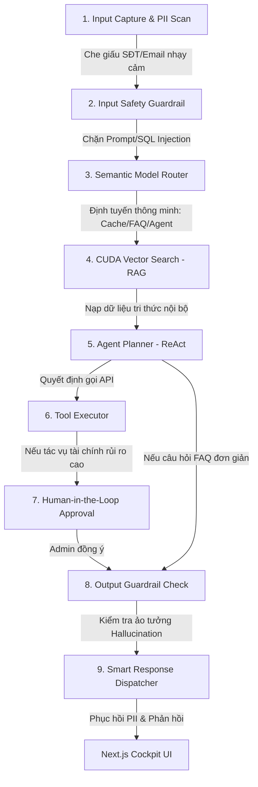

# 🚀 AI-Native Operations Copilot for SME Service Businesses
## 🇻🇳 Vietnam AI Innovation Challenge 2026 - Dự Án Đi Thi Cấp Độ Chuyên Nghiệp

Đây là repository chuẩn mực được thiết kế theo kiến trúc **AI-Native Software (Maturity Level 5-6 LLMOps)** nhằm giải quyết bài toán tự động hóa vận hành, quản lý dịch vụ khách hàng có kiểm soát dành cho các doanh nghiệp vừa và nhỏ (SMEs).

---

## 📌 1. Tuyên Bố Sản Phẩm & Ý Tưởng Cốt Lõi
> “Chúng tôi không xây dựng một chatbot trả lời câu hỏi thông thường. Chúng tôi thiết kế một quy trình vận hành AI-native, nơi AI nằm ở trung tâm (Orchestrator) hiểu dữ liệu, truy xuất chính sách, đề xuất hành động, tự động gọi công cụ nghiệp vụ và chỉ thực thi các giao dịch tài chính rủi ro khi có sự phê duyệt từ quản trị viên.”

### 💡 Tại sao là AI-Native?
* **Phần mềm truyền thống**: Menu $\rightarrow$ Form $\rightarrow$ CRUD $\rightarrow$ Report. (Con người tự bấm chọn từng bước).
* **Phần mềm AI-Native**: User Goal $\rightarrow$ Context Grounding $\rightarrow$ AI Reasoning $\rightarrow$ Tool Call $\rightarrow$ Human Approval $\rightarrow$ Telemetry. (AI điều phối, con người giám sát).

---

## 🧱 2. Kiến Trúc 9 Bước Vận Hành AI-Native (Trace Flow)

Hệ thống triển khai đầy đủ chốt bảo vệ an toàn và truy vết nghiệp vụ qua 9 bước độc lập:



1. **Input Capture & PII Scan**: Lọc bỏ các thông tin định danh cá nhân (PII) như Số điện thoại, Email, Số CCCD sang dạng `[REDACTED]` để bảo vệ quyền riêng tư trước khi gửi lên LLM.
2. **Input Safety Guardrail**: Ngăn chặn tấn công Prompt Injection, System Override hoặc chèn mã độc.
3. **Semantic Model Router**: Tiết kiệm chi phí và giảm độ trễ bằng cách định tuyến các câu hỏi FAQ đơn giản sang Cache/Model nhỏ, và chỉ dùng Model Agent lớn đối với các thao tác cần gọi công cụ.
4. **Vector Search (RAG)**: Truy xuất các chính sách nghiệp vụ thực tế từ cơ sở dữ liệu Vector DB.
5. **Agent Planner**: LLM lập kế hoạch giải quyết vấn đề theo mẫu ReAct (Thought $\rightarrow$ Action $\rightarrow$ Observation).
6. **Tool Executor**: Thực thi các thao tác đọc ghi cơ sở dữ liệu (tạo ticket hỗ trợ, tra cứu lịch đặt sân).
7. **Human-in-the-Loop (HITL)**: Các hành động nhạy cảm (như hủy sân, hoàn trả tiền ví Momo) sẽ bị tạm dừng và tạo yêu cầu duyệt trên Dashboard của Admin.
8. **Output Guardrail Check**: Đo lường mức độ trùng khớp giữa câu trả lời của LLM với văn bản gốc (RAG) nhằm chấm điểm rủi ro ảo tưởng (Hallucination Risk Score).
9. **Smart Response Dispatcher**: Khôi phục lại các thông tin PII từ mapping cục bộ để cá nhân hóa phản hồi cho khách hàng và gửi về UI.

---

## 💻 3. Cấu Trúc Repository Monorepo
Repository được tổ chức theo cấu trúc chuyên nghiệp để nhóm (Frontend, Backend, AI) có thể làm việc song song:

* **[frontend/](file:///C:/Users/Admin/Desktop/github/vietnam-ai-challenge-2026/frontend)**: Next.js 13+ App Router (Velzon Premium Template).
  * Tích hợp trang **[AI Copilot Cockpit](file:///C:/Users/Admin/Desktop/github/vietnam-ai-challenge-2026/frontend/src/app/%28with-layout%29/ai-copilot/page.tsx)** theo dõi luồng Trace Flow trực quan, Telemetry logs và hàng đợi Human-in-the-loop.
* **[backend/](file:///C:/Users/Admin/Desktop/github/vietnam-ai-challenge-2026/backend)**: RESTful API viết bằng FastAPI (Python). Quản lý cơ sở dữ liệu giả lập và định nghĩa các API điều phối.
* **[ai_layer/](file:///C:/Users/Admin/Desktop/github/vietnam-ai-challenge-2026/ai_layer)**: Lớp AI điều phối trung tâm bao gồm:
  * `guardrails/`: Module quét PII, Input/Output safety check.
  * `rag/`: Vector DB nhúng cục bộ và dữ liệu seed chính sách nội bộ.
  * `agents/`: Trình lập kế hoạch ReAct Loop kết nối LLM.
  * `tools/`: Registry đăng ký và gọi công cụ động.
* **[docs/](file:///C:/Users/Admin/Desktop/github/vietnam-ai-challenge-2026/docs)**: Tài liệu dự án và hướng dẫn sử dụng UI Velzon.

---

## 🛠️ 4. Hướng Dẫn Cài Đặt & Chạy Dự Án

### Yêu cầu hệ thống:
* **Python**: 3.10 trở lên.
* **NodeJS**: 18 trở lên (để chạy Next.js).
* **Ollama (Khuyên dùng chạy Local)**: Tải mô hình `llama3.2` (`ollama run llama3.2`) hoặc cấu hình OpenAI key trong `.env`.

### Khởi chạy nhanh bằng script PowerShell (1-Click):
Mở terminal PowerShell tại thư mục gốc của dự án và chạy:
```powershell
Set-ExecutionPolicy Bypass -Scope Process -Force
.\run_project.ps1
```
*Script sẽ tự động khởi tạo virtual environment cho Python, cài đặt dependencies cho cả Backend/Frontend và chạy 2 ứng dụng ở 2 màn hình riêng biệt.*

* **Frontend Dashboard**: [http://localhost:3000/ai-copilot](http://localhost:3000/ai-copilot)
* **Backend Swagger Docs**: [http://localhost:8000/docs](http://localhost:8000/docs)

### Cấu hình Docker (Dành cho deploy/production):
Nếu máy đã cài Docker, bạn có thể chạy toàn bộ hệ thống bằng 1 lệnh:
```bash
docker-compose up --build
```

---

## 🤝 5. Hướng Dẫn Setup Github Organization
Để làm việc nhóm chuyên nghiệp nhất phục vụ cuộc thi, bạn hãy thực hiện các bước sau:
1. Truy cập [github.com/organizations/new](https://github.com/organizations/new) để tạo một Tổ chức (Organization) miễn phí cho đội của bạn.
2. Tạo 3 Repository riêng biệt trong Organization tương ứng với 3 thành phần chính:
   * `frontend` (Đưa toàn bộ code thư mục `frontend/` lên).
   * `backend` (Đưa code của `backend/` và `ai_layer/` lên).
   * `project-docs` (Đưa các tài liệu thuyết trình, pitch deck, thiết kế kiến trúc lên).
3. Thiết lập các nhánh bảo vệ (`branch protection rules`) cho nhánh `main` để yêu cầu Pull Request và duyệt code trước khi merge, thể hiện sự chuyên nghiệp với Ban giám khảo cuộc thi!

Chúc đội của bạn đạt kết quả cao nhất tại **Vietnam AI Innovation Challenge**!
