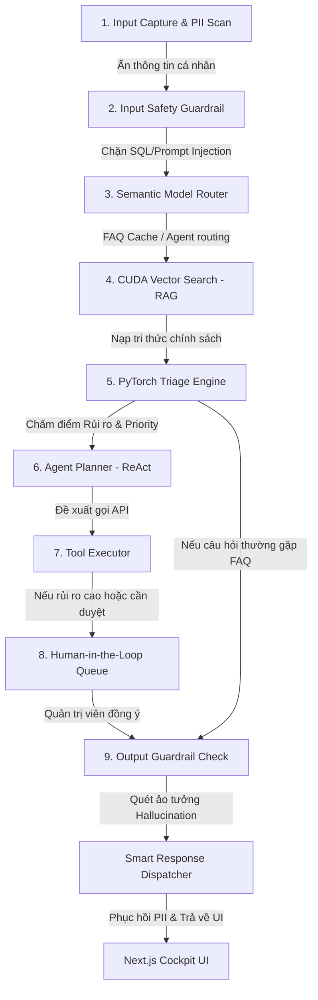

# 🚀 AI-Native Operations Copilot for SME & Multidomain Workflows
## 🇻🇳 Vietnam AI Innovation Challenge 2026 - Dự Án Đi Thi Cấp Độ Chuyên Nghiệp

Đây là repository chuẩn mực được thiết kế theo kiến trúc **AI-Native Software (Maturity Level 5-6 LLMOps)** phục vụ cho cuộc thi **VAIC 2026**. Dự án được cấu trúc sẵn để **bảo đảm giải quyết tốt mọi đề bài** thuộc 3 lĩnh vực cốt lõi (SME, Giáo dục, Nông nghiệp) bằng cách cho phép chuyển đổi nhanh cấu hình, đồng bộ RAG, và tích hợp mô hình phân loại rủi ro PyTorch.

---

## 📌 1. Ý Tưởng Cốt Lõi: Đóng Gói Domain Pack & PyTorch Engine
- **Không chỉ là chatbot**: AI đóng vai trò điều phối trung tâm (Orchestrator).
- **Domain-Adaptable Architecture**: Toàn bộ hệ thống (dữ liệu CSDL, tri thức RAG, từ khóa định tuyến, danh mục công cụ API) được đóng gói độc lập trong thư mục `domains/`.
- **PyTorch Risk Engine**: Tích hợp một mô hình mạng thần kinh đa nhiệm (`ImpactTriageNet` viết bằng PyTorch) chạy suy luận cực nhanh (< 2ms) để chấm điểm rủi ro nghiệp vụ và tự động kích hoạt hàng đợi phê duyệt của con người (Human-in-the-loop).

---

## 🧱 2. Luồng Trace Flow Vận Hành 9 Bước



---

## 💻 3. Cấu Trúc Monorepo Chuẩn Bị Cho D-Day

- **`domains/`**: Chứa tài liệu học thuật (Product Canvas, Problem Brief, Pilot Plan, Risk Plan) và dữ liệu hạt giống (database mock, RAG text, training dataset) cho 3 track:
  - **`sme/`**: Quản lý đặt sân thể thao, sự cố thanh toán MoMo.
  - **`education/`**: Phát hiện sớm sinh viên nguy cơ rớt môn, học bổng.
  - **`agriculture/`**: Giám sát sâu bệnh, lập lịch tưới cây và bảo vệ thực vật.
- **`ai_layer/pytorch_engine/`**: Bộ máy học sâu độc lập:
  - `model.py`: Mạng Multi-task Net (`ImpactTriageNet` kế thừa `torch.nn.Module`).
  - `dataset.py`: Trích xuất feature định lượng và nhúng text, sinh dữ liệu huấn luyện giả lập.
  - `train.py`: Tập lệnh huấn luyện mô hình.
  - `evaluate.py`: Tính toán các chỉ số F1, Precision, Recall.
  - `inference.py`: Suy luận thời gian thực với chế độ fallback an toàn.
  - `export_onnx.py` & `benchmark.py`: Tối ưu biên dịch và kiểm thử hiệu năng.
- **`scripts/`**: Công cụ tự động hóa:
  - `switch_domain.py`: Chuyển nhanh domain của backend live.
  - `seed_domain.py`: Tự động nạp dữ liệu RAG/CSDL và tiền huấn luyện weights cho PyTorch.
- **`docs/`**: Bộ tài liệu chiến lược (Pitching, Q&A, PyTorch Strategy, Day-D Runbook).

---

## 🛠️ 4. Hướng Dẫn Khởi Chạy & Sử Dụng

### Yêu cầu hệ thống:
- **Python**: 3.10 trở lên.
- **NodeJS**: 18 trở lên.

### Hướng dẫn 1-Click Khởi chạy (PowerShell):
Mở terminal tại thư mục gốc và chạy:
```powershell
Set-ExecutionPolicy Bypass -Scope Process -Force
.\run_project.ps1
```
*Script sẽ khởi tạo virtualenv, tải các thư viện của Backend và Frontend Next.js, sau đó khởi động song song 2 ứng dụng.*
- **Giao diện Dashboard**: [http://localhost:3000/ai-copilot](http://localhost:3000/ai-copilot)
- **Tài liệu API Swagger**: [http://localhost:8000/docs](http://localhost:8000/docs)

---

## 💡 5. Hướng Dẫn Thao Tác Thực Chiến Trên UI (Demo Guide)

Hệ thống hỗ trợ **Chuyển đổi Lĩnh vực Trực quan** ngay trên thanh tiêu đề của giao diện Dashboard:

1. **Bước 1: Chọn Domain**: Click chọn một trong ba nút **SME**, **Education**, hoặc **Agriculture** trên Dashboard.
2. **Bước 2: Xem CSDL biến đổi**: Bảng dữ liệu vận hành (bookings, students, hoặc farms) sẽ tự động thay đổi cấu trúc bảng tương ứng.
3. **Bước 3: Nhập câu lệnh thử nghiệm**:
   - *SME*: *"Tôi muốn hủy đặt sân BKG-88321A và hoàn tiền gấp qua Momo."*
   - *Education*: *"Sinh viên STU-1002 vắng mặt liên tiếp 3 buổi học phần Lập trình Python, hãy đưa ra đề xuất."*
   - *Agriculture*: *"Lô vườn FRM-502 phát hiện vệt nấm đốm nâu đạo ôn lúa nặng, cần phun hóa chất diệt trừ gấp."*
4. **Bước 4: Theo dõi Trace Flow**: Xem cách PyTorch Engine phân tích rủi ro, RAG đối chiếu chính sách, và cách hệ thống tự động đưa yêu cầu vào **Human-in-the-Loop Queue**.
5. **Bước 5: Phê duyệt**: Admin kiểm tra thông số và nhấn **Approve** để kích hoạt cập nhật cơ sở dữ liệu.

---

## 📅 6. Lệnh CLI Thường Dùng (Dành cho Lập trình viên)

### Khởi tạo & Seeding toàn bộ 3 Domain:
```bash
python scripts/seed_domain.py --domain all --train
```
*(Chạy lệnh này để nạp dữ liệu RAG và huấn luyện sẵn các mô hình PyTorch trước khi lên sân khấu).*

### Chuyển đổi Domain thủ công:
```bash
python scripts/switch_domain.py education
```

### Huấn luyện lại mô hình PyTorch cho Domain cụ thể:
```bash
python -m ai_layer.pytorch_engine.train --domain agriculture --epochs 20
```

### Đo đạc hiệu năng mô hình PyTorch:
```bash
python -m ai_layer.pytorch_engine.benchmark --domain education
```
