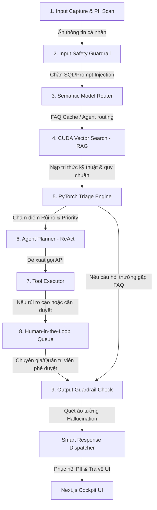

# 🚀 VAIC 2026: CropDoctor AI Platform

## 🇻🇳 Vietnam AI Innovation Challenge 2026 - Dự Án Đi Thi Cấp Độ Chuyên Nghiệp (Professional Track)

Hệ thống phần mềm chuẩn mực được thiết kế theo kiến trúc **AI-Native Software (Maturity Level 5-6 LLMOps)** phục vụ cho cuộc thi **VAIC 2026**. Dự án tập trung giải quyết triệt để bài toán tối ưu vận hành nông trang và chẩn đoán lâm sàng nông nghiệp công nghệ cao.

---

## 📁 Sơ Đồ Cấu Trúc Tổng Thể Monorepo

```text
vietnam-ai-challenge-2026/
├── ai_layer/                              # Phân lớp xử lý trí tuệ nhân tạo chuyên sâu
│   ├── cropdoctor/                        # Hệ thống Multi-Agent của CropDoctor AI
│   │   ├── agents/                        # Định nghĩa 6 Agent tự trị chuyên biệt
│   │   │   ├── vision_consensus_agent.py  # Phân tích ảnh và xuất trắc lượng thị giác
│   │   │   ├── symptom_agent.py           # Thu thập triệu chứng lâm sàng tương tác
│   │   │   ├── context_agent.py           # Tra cứu dữ liệu thời tiết & bối cảnh thực địa
│   │   │   ├── reasoning_agent.py         # Lập luận hợp nhất đa tác nhân (DeepSeek Engine)
│   │   │   ├── safety_agent.py            # Thẩm định an toàn sinh học IPM
│   │   │   └── diary_agent.py             # Đăng ký nhật ký số & nhắc lịch tự động
│   │   └── api/                           # Router phân phối kết quả Agent chẩn đoán
│   └── pytorch_engine/                    # Bộ máy học sâu phân loại rủi ro
│       ├── model.py                       # Mạng ImpactTriageNet (torch.nn.Module)
│       ├── dataset.py                     # Bộ tiền xử lý & nhúng dữ liệu vector
│       ├── train.py                       # Tập lệnh huấn luyện mô hình học sâu
│       ├── evaluate.py                    # Đánh giá độ chính xác (Precision, Recall, F1)
│       └── inference.py                   # Suy luận thời gian thực với cơ chế fallback
├── backend/                               # Máy chủ Backend FastAPI (Python)
│   ├── app/
│   │   ├── db/                            # Quản lý kết nối MongoDB & Demo Memory Store
│   │   ├── routes/                        # Các tuyến API nghiệp vụ chính (Farms, Cases, Map...)
│   │   └── services/                      # Nghiệp vụ điều phối dữ liệu & startup dữ liệu hạt giống
│   └── tmp_uploads/                       # Lưu trữ tệp ảnh lâm sàng tải lên
├── frontend/                              # Giao diện điều khiển Cockpit Next.js (TypeScript)
│   ├── src/
│   │   ├── app/                           # Cấu trúc App Router của Next.js
│   │   │   ├── (with-layout)/
│   │   │   │   ├── ai-copilot/            # Phân hệ Copilot Vận Hành Nông Trại
│   │   │   │   ├── diagnosis/             # Phân hệ CropDoctor AI Diagnosis Cockpit
│   │   │   │   ├── farms/                 # Quản lý nông trang vận hành thật
│   │   │   │   ├── cooperative/           # Bản đồ phân bố dịch bệnh khu vực
│   │   │   │   ├── ai/agent-logs/         # Nhật ký kiểm toán trace bước chạy của Agent
│   │   │   │   └── reminders/             # Lịch nhắc chăm sóc mùa vụ động
│   │   └── components/                    # Thư viện component giao diện Velzon
│   └── public/                            # Tài nguyên tĩnh
└── README.md                              # Tài liệu hướng dẫn này
```

---

## 🧱 1. Phân Hệ 1: AI-Native Operations Copilot (Agriculture)

Giải pháp điều phối nghiệp vụ thông minh cho lĩnh vực **Nông nghiệp (Vận hành nông trại)**.

### Luồng Vận Hành 9 Bước (Trace Flow)


### Các Tính Năng Cốt Lõi:
1.  **Semantic Agriculture Context**: Tự động nhận diện và cập nhật tri thức RAG, cấu trúc CSDL nông trại và tập lệnh API nông nghiệp.
2.  **PyTorch ImpactTriageNet Engine**: Mô hình mạng thần kinh đa nhiệm tự động chấm điểm mức độ rủi ro của yêu cầu (< 2ms). Nếu độ rủi ro vượt ngưỡng an toàn (ví dụ: bùng phát dịch bệnh lớn hoặc đề xuất thuốc hóa học độc hại), hệ thống tự động đưa vào hàng đợi phê duyệt của chuyên gia (**Human-in-the-Loop**).
3.  **Hàng đợi phê duyệt (HitL Queue)**: Cho phép chuyên gia nông nghiệp xem xét các hành động nhạy cảm như đề xuất phun hóa chất độc hại hoặc cập nhật nhật ký bệnh án trước khi CSDL thật được cập nhật.

---

## 🩺 2. Phân Hệ 2: CropDoctor AI (Nông Nghiệp Số & Lâm Sàng Thực Vật)

Hệ thống chẩn đoán dịch bệnh đa tác nhân kết hợp dữ liệu bối cảnh thời tiết thời gian thực và đề xuất giải pháp bảo vệ thực vật theo chuẩn **IPM**.

### Hệ thống 6 AI Agent Tự Trị (Multi-Agent System)
1.  **Vision Consensus Agent**: Nhận dạng hình ảnh lá/quả bệnh, đo lường số lượng vết bệnh (`lesion_count`), tỷ lệ diện tích hư hại (`leaf_area_affected`) và trắc lượng chất lượng ảnh chụp (`image_quality`).
2.  **Symptom Agent**: Khai thác câu hỏi lâm sàng bổ sung đối với người nông dân về tốc độ lây lan, thời điểm bùng phát dịch bệnh.
3.  **Context Agent**: Lấy dữ liệu khí tượng địa lý (nhiệt độ, độ ẩm 85-92%, lượng mưa) của Trảng Bom/Long Thành Đồng Nai nhằm đối chiếu điều kiện sinh trưởng của nấm hại.
4.  **Reasoning Agent (DeepSeek Engine)**: Hợp nhất dữ liệu của Vision, Symptom và Context Agent thông qua LLM DeepSeek để đưa ra kết luận chẩn đoán cuối cùng với độ tin cậy được tối ưu hóa.
5.  **Safety Agent (IPM Auditor)**: Đóng vai trò chốt chặn an toàn sinh học, cảnh báo chống lạm dụng thuốc bảo vệ thực vật hóa học, ưu tiên đề xuất biện pháp cơ học/sinh học IPM trước.
6.  **Diary Agent**: Tự động đăng ký sự kiện vào nhật ký mùa vụ của nông trại và lên lịch nhắc nhở theo dõi lâm sàng sau 48h.

### Các Giao Diện Chức Năng Chính:
*   **Bàn chẩn đoán lâm sàng (`/diagnosis/new`)**: Upload ảnh kéo thả, hỗ trợ zoom ảnh cực đại với bộ công cụ Lightbox xem chi tiết vết bệnh, tự động trích xuất tên ảnh gốc của tệp tải lên, vẽ sơ đồ tiến trình 6 Agent chạy trực tiếp.
*   **Bệnh án lịch sử (`/diagnosis/history`)**: Bảng quản lý toàn bộ ca chẩn đoán thực tế lấy từ MongoDB. Nút xem chi tiết (`ri-eye-line`) hiển thị đầy đủ hình ảnh gốc kèm tên file ảnh, biểu đồ độ tin cậy và **Nhật ký audit log chi tiết của 6 Agent** của riêng ca bệnh đó.
*   **Danh sách ca cần theo dõi (`/diagnosis/follow-up`)**: Quản lý các ca bệnh chờ phản hồi triệu chứng, các ca bệnh nguy cấp chờ chuyên gia phê duyệt đơn thuốc và nhắc nhở lịch chụp lại ảnh.
*   **Bản đồ dịch bệnh hợp tác xã (`/cooperative/map`)**: Biểu diễn tọa độ phân bố ca dịch hại theo khu vực thực tế (Trảng Bom, Long Thành, Nhơn Trạch...). Đi kèm bảng tin cảnh báo bùng phát dịch bệnh theo thời gian thực.
*   **Nhật ký kiểm toán hệ thống AI (`/ai/agent-logs`)**: Công cụ debug chuyên sâu cho các kỹ sư, hiển thị thời gian chạy (latency), dữ liệu đầu vào/đầu ra và các bằng chứng thực nghiệm (evidence) của từng Agent. Hỗ trợ tự động định vị trace của ca bệnh khi bấm chuyển từ danh sách lịch sử.

---

## 🛠️ 3. Cài Đặt & Khởi Chạy Nhanh

### Yêu cầu hệ thống:
*   **Python**: 3.10 trở lên
*   **NodeJS**: 18 trở lên
*   **MongoDB** (Tùy chọn, hệ thống tự động fallback sang Demo Memory Store nếu không kết nối được MongoDB)

### Cấu hình biến môi trường (`.env` ở thư mục gốc):
Tạo file `.env` tại thư mục gốc của dự án và điền cấu hình API DeepSeek:
```ini
# DeepSeek API config
DEEPSEEK_API_KEY=
DEEPSEEK_BASE_URL=https://api.deepseek.com/v1
DEEPSEEK_MODEL=deepseek-chat
```

### 1-Click Khởi chạy (Dành cho Windows - PowerShell):
Mở terminal PowerShell tại thư mục gốc và thực thi:
```powershell
Set-ExecutionPolicy Bypass -Scope Process -Force
.\run_project.ps1
```
*Script sẽ tự động khởi tạo môi trường ảo Python venv, cài đặt các thư viện backend, cài đặt dependencies frontend Next.js và khởi chạy cả hai cổng dịch vụ song song.*

*   **Giao diện Dashboard**: [http://localhost:3000/ai-copilot](http://localhost:3000/ai-copilot) hoặc [http://localhost:3000/diagnosis/history](http://localhost:3000/diagnosis/history)
*   **API Swagger**: [http://localhost:8000/docs](http://localhost:8000/docs)

---

## 📅 4. Các Lệnh CLI Hữu Ích

### Huấn luyện và nạp dữ liệu hạt giống (Seed & Train):
```bash
# Nạp dữ liệu hạt giống cho nông nghiệp và huấn luyện mạng PyTorch
python scripts/seed_domain.py --domain agriculture --train
```

### Huấn luyện lại mạng thần kinh PyTorch nghiệp vụ:
```bash
python -m ai_layer.pytorch_engine.train --domain agriculture --epochs 20
```

### Đo đạc hiệu năng mô hình (Benchmark):
```bash
python -m ai_layer.pytorch_engine.benchmark --domain agriculture
```
