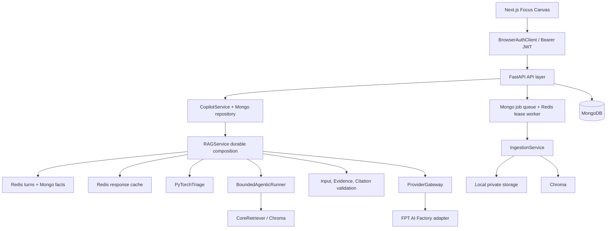
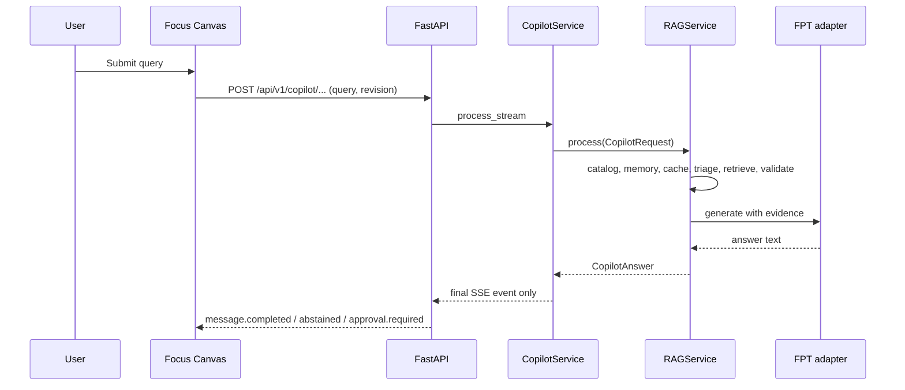
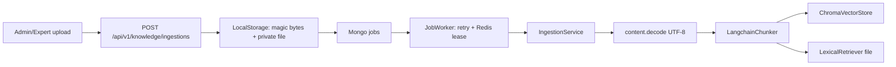

# Báo cáo Technical Review AI-Native Platform

**Ngày audit:** 13/07/2026  
**Nhánh được kiểm tra:** TienThanh/RAG  
**Phạm vi:** source hiện tại trong workspace, không dựa riêng vào README.  
**Kết luận chứng nhận:** **NEEDS WORK — chưa nghiệm thu Production.** Có thể demo cuộc thi sau khi khắc phục các lỗi luồng Copilot nêu ở P0/P1.

## 0. Phương pháp và giới hạn bằng chứng

Audit này kiểm kê 3.470 file không gồm dependency/build cache; trong đó có 267 file Python, 499 TSX, 150 TypeScript và một lượng lớn asset/template Velzon. Tôi đọc implementation của composition root, API, auth, Copilot, RAG, worker/ingestion, persistence, provider, validator, registry, observability, Domain Pack, CI/Compose và UI Focus Canvas; đồng thời truy vết các lời gọi bằng tìm kiếm source.

Các lệnh kiểm chứng thực thi trong môi trường audit:

| Kiểm chứng | Kết quả |
| --- | --- |
| Python test mặc định | Không chạy: Python MSYS không cài pytest. |
| Python test với runtime bundle | Không chạy: runtime thiếu pydantic-settings và transformers khi import backend. |
| Frontend quality gate | Vitest khởi động nhưng không hoàn tất trước timeout 74 giây của môi trường audit. |
| git diff --check | Có trailing whitespace ở các file đã thay đổi, gồm ai_layer/rag/agentic/state.py, chunker, CopilotService và backend main. |
| Docker Compose smoke | Chưa xác minh trong audit này vì Docker Desktop daemon phía máy đang không chạy. |

Vì các lý do trên, báo cáo **không khẳng định test/build/Compose đang pass**. Những phần không thể xác minh bằng implementation hoặc runtime được ghi rõ.

## 1. Executive Summary

Canopy/CropDoctor giải quyết bài toán hỗ trợ chẩn đoán cây trồng, tư vấn tri thức và Copilot có citation, đồng thời hướng tới tái sử dụng cho Domain Pack khác. Giá trị business là giảm thời gian tổng hợp bằng chứng/chẩn đoán sơ bộ; giá trị AI nằm ở RAG, typed abstention, định tuyến rủi ro, citation validation và cơ chế approval.

Điểm khác biệt với chatbot thông thường là ý đồ phòng thủ nhiều lớp đã hiện diện trong source: input validator, evidence scope/checksum/freshness validator, citation validator, cache key versioned, memory facts cần consent, provider gateway có retry/circuit breaker và structured abstention.

Tuy vậy, implementation runtime hiện chưa khép kín các contract quan trọng:

- Memory được load và lưu nhưng **không được đưa vào retrieval hoặc prompt**.
- Runtime RAG khởi tạo cứng FPT AI Factory; registry/provider order của Domain Pack không điều khiển gateway.
- Hybrid search, FPT reranker, parser PDF/DOCX/XLSX và LLM judge có source nhưng chưa nối vào luồng production Copilot.
- Frontend chọn domain Education/SME nhưng không gửi domain_id; backend mặc định agriculture, trong khi chỉ có một Domain Pack agriculture.
- Backend SSE trả một event kết thúc duy nhất; không phát token/citation events mà UI được thiết kế để tiêu thụ.
- Typed approval được tạo trong RAG nhưng không được lưu thành approval workflow; GET /api/approvals luôn trả mảng rỗng.
- Ingestion chấp nhận PDF/DOCX/XLSX nhưng decode bytes theo UTF-8 thay vì gọi parser tương ứng.

**Phân loại hiện trạng:** đây là **AI Product vertical prototype có nền móng platform**; chưa phải AI Platform/Business AI Platform/AI Operating System. Đây là đánh giá theo runtime wiring, không phủ nhận giá trị của các abstraction đã viết.

## 2. Kiến trúc đã xác minh

### Luồng Copilot thực tế

**Lệch contract:** Focus Canvas có domain state nhưng request body chỉ gửi query và expected_conversation_revision. CopilotService vì vậy dùng domain mặc định agriculture. Cũng trong luồng này, C gọi RAGService.process thay vì RAGService.stream; event token.delta và citation.added không được phát ra.

### Luồng ingestion thực tế

Job queue, idempotency và Redis lease được triển khai. Nhưng parser theo content type không được gọi; PDF/DOCX/XLSX sẽ bị decode text thay vì parse cấu trúc. Lexical index được ghi nhưng runtime CoreRetriever không dùng HybridRetriever.

## 3. Công nghệ thực tế và đánh giá

| Công nghệ | Vai trò/source | Đánh giá |
| --- | --- | --- |
| Next.js 16, React 19, TypeScript | frontend package.json, Focus Canvas | Phù hợp UI; template Velzon quá lớn làm tăng surface area và build risk. |
| Tailwind/SCSS/Bootstrap/Framer Motion | Focus Canvas + legacy UI | Focus Canvas nhất quán hơn template; đồng thời dùng nhiều UI system gây debt. |
| FastAPI, Pydantic v2 | backend app/main.py, contracts | Phù hợp API typed; route boundary còn dùng dict tự do ở Copilot stream. |
| MongoDB + Motor | auth, conversation, jobs, approvals, schema | Phù hợp document/session; indexes/schema có chủ đích. |
| Redis | rate limit, cache, memory, worker lease | Đúng vai trò; rate limit fixed-window, chưa có quota theo tenant/user. |
| ChromaDB | vector store HTTP/persistent | Hợp hackathon và prototype; chưa có lifecycle/index revision bền vững. |
| Sentence Transformers/CrossEncoder | embeddings/retrieval | Phù hợp multilingual offline; thiếu benchmark/evaluation vận hành. |
| FPT AI Factory | runtime RAG adapter, embedding/rerank source | Đúng mục tiêu giải thưởng; chat runtime hard-code nên giảm portability. |
| OpenAI SDK/DeepSeek | CropDoctor reasoning, generic OpenAILLM | DeepSeek có source cho diagnosis; chưa phải provider runtime của Copilot. |
| PyTorch/Torchvision/Transformers | vision, triage | Có capability; nhiều fallback/demo nên chưa chứng minh chất lượng field production. |
| Docker Compose/Nginx | deploy | Topology tốt cho demo; chưa có kết quả smoke mới trong audit. |
| GitHub Actions | .github/workflows/ci.yml | Có intent gates; cần chứng minh run xanh. Supply-chain job không setup Node trước npm audit. |

Khuyến nghị công nghệ: giữ FastAPI, Mongo/Redis, Chroma cho cuộc thi; hợp nhất UI stack, loại route/template không thuộc product, và chỉ giới thiệu provider qua adapter/registry thực sự được composition root dùng.

## 4. Đánh giá module

| Module | Vai trò đã xác minh | Điểm /10 | Nhận xét kiến trúc |
| --- | --- | ---: | --- |
| frontend/features/copilot | SSE client, reducer, Focus Canvas, abstain UX | 6 | UX tốt nhưng domain/citation streaming chưa nối đúng backend. |
| frontend tổng thể | Next.js app + template Velzon | 4 | 346 app files, nhiều demo/fake route; coupling và build surface lớn. |
| backend/app/main.py | composition root, middleware, routers | 6 | Auth mặc định toàn cục tốt; pha trộn legacy route và new bounded module. |
| backend/auth | JWT, refresh rotation, RBAC, audit | 8 | Thành phần mạnh nhất; refresh cookie HttpOnly/SameSite, role guard rõ. |
| backend/copilot | session/idempotency/SSE persistence | 5 | Revision/idempotency tốt; streaming/citation và error boundary chưa khép kín. |
| backend/knowledge + worker | private upload, queue, retry, lease | 6 | Cơ chế job tốt; parsing/index lifecycle là khoảng trống P1. |
| ai_layer/rag/service | policy orchestration | 6 | Typed abstention/caching tốt; memory, registry, retry rewrite chưa được wiring hoàn chỉnh. |
| ai_layer/rag/validation | input/evidence/citation checks | 7 | Defensive design rõ; citation overlap là heuristic, chưa phải semantic verifier. |
| ai_layer/rag/memory | scoped turns/facts/consent | 7 | Isolation tốt; context chưa ảnh hưởng response nên business value chưa hiện thực. |
| ai_layer/rag/registries | manifests, catalog, frozen registry | 5 | Abstraction có chất lượng; runtime không đăng ký provider/tool nên chưa là plugin architecture hoạt động. |
| ai_layer/rag/retrieval | dense, lexical, RRF, reranker | 5 | Có thành phần Agentic/Hybrid; CoreRetriever chỉ dùng dense + local CrossEncoder. |
| CropDoctor vision/reasoning | diagnosis vertical agents | 5 | Có demo narrative; fallback/mock rộng, cần phân tách demo và decision-grade output. |
| approvals/HITL | approval records/repository/routes | 3 | Approval RAG không persist; list route trả [] cố định. |
| observability/evaluation | trace redaction, scorecard | 4 | Data model tốt nhưng metric registry không thấy được ghi từ runtime; LLM judge gọi deprecated SQLite stub. |

## 5. AI Layer và Agentic RAG

### Thành phần đã có

- InputValidator phát hiện một số pattern injection, PII email/điện thoại và giới hạn độ dài.
- EvidenceValidator kiểm tra tenant/domain, checksum, status, score, expiry, freshness/diversity.
- CitationValidator kiểm tra citation thuộc retrieval set, scope/index revision, marker inline và overlap token.
- ProviderGateway có retry exponential backoff, fallback policy, circuit breaker in-memory và trace metadata.
- RAGService có cache key gắn tenant/domain/domain pack/index/prompt/policy/provider/validator/session/revision.
- Memory facts chỉ lấy confirmed + consent; propose chỉ từ user message và allow-list theo Domain Pack.
- BoundedAgenticRunner có retrieve, reflection và query rewrite giới hạn vòng lặp.

### Khoảng cách với Agentic RAG production

| Hạng mục | Bằng chứng | Trạng thái |
| --- | --- | --- |
| Query rewrite sau evidence yếu | AssurancePipeline trả RETRIEVAL_REWRITE, nhưng RAGService gọi với retrieval_attempt=1/max=1 rồi return outcome nếu không PASS. | Chưa thực thi retry/retrieve rewrite. |
| Reflection an toàn | lỗi gọi reflection mặc định is_relevant=True. | Fail-open ở bước đánh giá relevance. |
| Memory-aware generation | memory_context chỉ dùng cho validator/cache flag; gateway nhận query và evidence. | Memory chưa được dùng trong response. |
| Hybrid search | HybridRetriever/RRF và LexicalRetriever có source; CoreRetriever chỉ dense search. | Chưa wiring runtime. |
| Rerank provider | FPTAIReranker có source; CoreRetriever dùng CrossEncoderReranker. | Chưa wiring runtime. |
| Parser đa định dạng | PDF/image/docx/excel parser có source; IngestionService decode bytes UTF-8. | Chưa wiring runtime. |
| Active index | active revision ở dict trong IngestionService process-local; EvidencePolicy không nhận active revision từ runtime. | Không bền vững/không enforce. |
| Provider registry | Domain manifest khai báo provider_order; build_rag_service tạo FPT adapter cứng. | Registry không điều khiển provider. |
| Evaluation release gate | scorecard/golden set có source; không thấy CI/runtime job gọi evaluation. | Chưa chứng minh operational gate. |
| LLM judge | gọi get_llm_provider và ai_layer/rag/memory/database.py đã raise NotImplementedError. | Không hoạt động end-to-end từ implementation hiện tại. |

Kết luận phần AI: kiến trúc **defensive RAG prototype tốt**, nhưng chưa đạt “production Agentic RAG” vì đường chạy chính chưa dùng đầy đủ capability đã khai báo.

## 6. Workflow, trạng thái và persistence

JobWorker dùng Mongo để claim, Redis lease token-owned, heartbeat Lua CAS, retry exponential+jitter và dead-letter status. Đây là thiết kế hợp lý cho worker nhỏ.

Các rủi ro workflow:

1. Worker healthcheck trong Compose chỉ assert CHROMA_URL tồn tại, không chứng minh worker đang poll/claim job.
2. Copilot session revision được cập nhật trước insert message; nếu insert message thất bại, revision và message có thể lệch vì không có transaction/outbox.
3. SSE replay có persistence, nhưng normal response chỉ có start/final event; contract event phong phú ở RAGService.stream không được dùng.
4. Approval-required không tạo ApprovalRecord, nên state machine Human-in-the-loop bị đứt.

## 7. Domain Pack và Plugin Architecture

Chỉ xác minh được Domain Pack agriculture tại domains/agriculture/domain.yaml. Domain này khai báo version, locale, prompt/policy/validator version, memory allow-list, retrieval config, provider order và tool risk class.

Không xác minh được từ implementation Domain Pack cho Healthcare, Education, Government, SME, Innovation hay Disaster. Frontend hiển thị Education/SME nhưng source không có domain manifest tương ứng; đây là UI promise vượt runtime capability.

Registry có freeze, config schema, healthcheck và version selection, nhưng composition root tạo RegistryCatalog không registries. Vì vậy hiện tại là **plugin-ready abstraction**, không phải plug-and-play architecture vận hành.

## 8. Frontend, UX và accessibility

Focus Canvas có chất lượng hướng AI product: 3-column workspace, phase/status, citation panel, explicit abstain state, recovery actions, approval state, keyboard label và responsive classes. Đây là phần thích hợp để demo cuộc thi.

Các gap cần sửa:

- selection domain chỉ thay badge/UI; submit không truyền domain_id;
- backend final event có citations nhưng reducer chỉ nhận citation.added, nên panel nguồn rỗng trong normal flow;
- access token không được tự refresh cho Copilot stream (Focus Canvas gọi fetch trực tiếp bằng accessToken);
- hơn 300 route template và fake backend còn trong bundle/source, nhiều auth/demo component không thuộc product;
- browser/UI acceptance, responsive và accessibility chưa xác minh được từ runtime trong audit này.

## 9. Backend, Clean Architecture, SOLID, DDD

Backend có dấu hiệu modular monolith tốt ở auth, copilot, knowledge, approvals, db và storage. Repository/Service/Dependency patterns được dùng thực tế. Dependency direction trong phần RAG còn bị vi phạm ở ingestion: ai_layer/rag/ingestion/service.py import backend.app.storage.object_storage, khiến AI core phụ thuộc backend infrastructure.

DDD: có các bounded context sơ bộ (Auth, Copilot, Knowledge, Diagnosis, Approvals), nhưng aggregate/domain events/anti-corruption layer chưa rõ. Nhiều legacy route gọi service/demo state trực tiếp. Đây là **modular monolith đang chuyển đổi**, chưa phải Clean Architecture hoàn chỉnh.

Design patterns đã xác minh: Repository, Service Layer, Adapter (FPT/OpenAI), Strategy-like provider, Registry, Factory/composition root, Middleware, State-machine-like job statuses, Cache-aside, Circuit Breaker, Retry, Idempotency, RBAC dependency injection. Không nên gọi là Event-Driven Architecture vì chưa có event bus/outbox subscriber vận hành.

## 10. Security, audit và observability

Điểm mạnh: JWT HMAC with required claims, refresh token rotation/family revoke, password hashing helpers, role guards, private knowledge storage với magic-byte validation, production config chặn wildcard CORS/demo mode, rate limit Redis fail-closed trong production, trace redaction cho query/token/password/PII.

Điểm cần cải thiện:

- rate limit theo path + IP fixed-window, chưa tenant/user/API-key quota và không có reverse-proxy trusted IP strategy;
- provider circuit breaker in-memory theo process, không chia sẻ trạng thái multi-instance;
- observability metrics endpoint tồn tại nhưng không thấy runtime record metrics;
- trace provider log token count = 0 và request_id = unavailable;
- audit cho Copilot/RAG decision/citation/policy chưa tạo immutable structured record thống nhất;
- secret scan/audit/build status CI chưa xác minh được bằng run thực tế.

## 11. Technical Debt ưu tiên

| Mức | Nợ kỹ thuật | Evidence implementation | Hành động |
| --- | --- | --- | --- |
| P0 | UI domain giả chức năng | FocusCanvas chọn education/sme, request không gửi domain_id; chỉ agriculture manifest. | Gửi domain_id typed, API validate domain, chỉ show enabled domains. |
| P0 | Citation panel không nhận dữ liệu | CopilotService chỉ final SSE; reducer chỉ append citation.added. | Dùng RAGService.stream hoặc map citations ở final event; thêm E2E test. |
| P0 | HITL không hoạt động | RAG approval không persist; GET approvals return []. | Persist ApprovalRecord atomically, RBAC queue/list/decision flow. |
| P1 | Memory không ảnh hưởng Copilot | load_context không truyền runner/gateway. | Tách conversational context khỏi evidence rồi inject theo policy/token budget. |
| P1 | Registry/provider không runtime-driven | build_rag_service hard-code FPT. | ProviderFactory từ catalog, fallback per domain, health/readiness validation. |
| P1 | Ingestion đa định dạng lỗi semantics | allowed uploads nhưng UTF-8 decode trực tiếp. | Parser registry theo content type, parse provenance, quarantine/retry status. |
| P1 | Hybrid/Rerank source không dùng | HybridRetriever/FPTAIReranker không được reference runtime. | Compose retriever pipeline và test retrieval quality. |
| P1 | Active index revision process-local | IngestionService dict không bền. | Persist index lifecycle/active alias trong Mongo/Chroma metadata; enforce retrieval filter. |
| P1 | Retriever config domain không áp dụng trọn vẹn | manifest top_k/reflect config không truyền vào CoreRetriever/runner. | Resolve config once per request, pass typed RetrievalPlan. |
| P2 | Legacy template/fake backend | 346 app dirs và fake backend, TODO demo routes. | Tách hoặc xóa template routes/assets trước production build. |
| P2 | Evaluation/metrics chưa operational | evaluator/metric source không thấy CI invoke. | Add dataset, threshold gate, telemetry dashboards/alerts. |
| P2 | Diff hygiene | git diff --check báo trailing whitespace. | Run formatter và gate clean diff. |

## 12. Chấm điểm AI-Native

| Tiêu chí | Điểm /10 | Cơ sở |
| --- | ---: | --- |
| AI-first | 7 | AI là core value, nhưng có fallback/demo rộng. |
| Workflow-first | 6 | Job worker và diagnosis flow có; Copilot stream/HITL chưa khép kín. |
| Configuration-driven | 5 | Domain manifest có nhưng provider/retrieval không fully consumed. |
| Plugin architecture | 4 | Registry có abstraction, runtime không register/resolve thực tế. |
| Capability-driven | 5 | Có interface/provider/parser/retriever; nhiều capability chưa wiring. |
| Domain-driven | 5 | Agriculture Pack tốt; các domain khác chưa có implementation. |
| Human-in-the-loop | 3 | Typed approval nhưng không persist/list/decision liên kết. |
| Explainability | 6 | Citation contract/validator có; UI normal flow không nhận citations. |
| Observability | 4 | Redaction/trace source có; metrics/trace business chưa đầy đủ. |
| Knowledge-driven | 6 | Ingestion + Chroma có; parser/index lifecycle/hybrid chưa hoàn chỉnh. |
| Enterprise architecture | 5 | Auth/DB/Compose tốt; coupling/legacy/runtime gaps còn lớn. |
| Business platform | 4 | Một vertical prototype, chưa multi-domain plug-and-play. |
| AI-Native tổng thể | **5.3** | Nền móng đáng tin nhưng chưa đủ khép kín để gọi production platform. |

## 13. Góc nhìn ban giám khảo AI-Native

**Điểm gây ấn tượng:** câu chuyện “defensive in depth” có source thật: durable memory scope, versioned cache, evidence/citation validation, abstain typed, worker lease/retry, auth và UI abstain. Nếu demo được luồng upload → worker → citation → abstain/approval, đây là khác biệt rõ với chatbot trả lời tự do.

**Điểm có thể bị hỏi ngay:** “Memory đã ảnh hưởng câu trả lời chưa?”, “domain mới plug-and-play ở đâu?”, “citation panel có hiển thị live không?”, “approval của chuyên gia có thật không?”, “PDF có parse không?”, “fallback/model provider có được quản trị theo Domain Pack không?”. Hiện source cho thấy các câu này chưa có câu trả lời production hoàn chỉnh.

**Hackathon readiness:** 6/10 nếu khóa phạm vi chỉ Agriculture, sửa P0, chuẩn bị data thật và demo offline fallback minh bạch.  
**Production readiness:** 4/10; không nghiệm thu cho public/high-stakes deployment.

## 14. Roadmap CTO

### Sprint 1 — Khép kín demo truth (P0, 3–5 ngày)

1. Dùng request schema Pydantic cho Copilot body gồm domain_id; frontend chỉ render domain manifest enabled.
2. Chuyển CopilotService sang bridge RAGService.stream hoặc emit citation.added/token.delta/retrieval events; reducer map citations trong final event như fallback.
3. Tạo ApprovalRecord khi status approval_required; endpoint list filter theo tenant/role và UI action thực.
4. Thêm integration test: domain selection, answered citation display, abstention, approval persistence/replay.
5. Chạy Docker smoke trên engine hoạt động và lưu evidence.

### Sprint 2 — RAG correctness (P1, 1–2 tuần)

1. Xây RetrievalPlan từ manifest: dense+lexical RRF, rerank, top_k, threshold, active index revision.
2. Thay UTF-8 decode bằng parser registry, store extraction/provenance/checksum/index status.
3. Persist document/index lifecycle và transactional staging/activate/rollback.
4. Bổ sung real retrieval rewrite loop; reflection fail-closed hoặc abstain theo policy.
5. Dùng MemoryContext theo prompt budget, tách user facts/conversation recap khỏi evidence và log policy decision.

### Sprint 3 — Platform hóa và release (P1/P2, 1–2 tuần)

1. Provider adapter registry gồm FPT/DeepSeek/OpenAI/local, fallback policy và health check per Domain Pack.
2. Tách legacy Velzon/fake-backend ra khỏi product build; đo size/route/build time.
3. Đưa golden dataset, adversarial injection, unsupported-claim, latency/cost threshold vào CI.
4. Export metrics/trace/audit theo correlation ID; add SLO alerting.
5. Thêm ít nhất một Domain Pack thứ hai end-to-end để chứng minh reuse.

## 15. Kết luận CTO

Tôi **không nghiệm thu production** ở trạng thái source đã audit. Lý do là P0 liên quan đến tính trung thực của demo/runtime (domain selection, citation stream, approval workflow) và P1 liên quan grounded RAG (ingestion parsing, index lifecycle, provider/registry, memory wiring) chưa được khép kín.

Tôi đánh giá đây là dự án có hướng kỹ thuật tốt hơn một chatbot demo: các contract validation, abstention, auth, worker reliability và cache/memory isolation cho thấy tư duy AI-Native đúng. Tuy nhiên, platform được đánh giá bằng đường chạy thực tế chứ không phải số lượng module. Sau Sprint 1 và một demo E2E có evidence, dự án có thể là bài thi AI-Native cạnh tranh mạnh; sau Sprint 2–3 mới có cơ sở gọi là reusable AI platform.

### Bảng đánh giá cuối

| Hạng mục | Điểm /10 |
| --- | ---: |
| AI Architecture | 6 |
| Enterprise Architecture | 5 |
| Business Value | 7 |
| AI-Native | 5 |
| Maintainability | 5 |
| Scalability | 5 |
| Reusability | 5 |
| Production Readiness | 4 |
| Hackathon Readiness | 6 |
| Innovation | 7 |

**Trạng thái cuối:** NEEDS WORK. Ưu tiên sửa đúng các contract P0 trước khi thêm tính năng mới.

