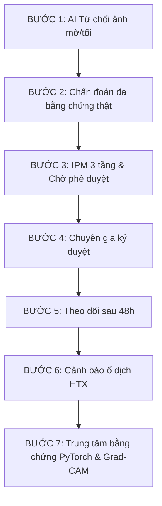

# Cẩm Nang Demo Thực Chiến CropDoctor AI

Tài liệu hướng dẫn cán bộ thuyết trình hoặc giám khảo trải nghiệm trọn vẹn luồng sản phẩm **CropDoctor AI** trong vòng 5-7 phút, làm nổi bật tư duy sản phẩm AI-native và các tính năng đột phá của dự án.

---

## 🎬 KỊCH BẢN DEMO 6 BƯỚC ĂN TIỀN

---

## 📂 THƯ MỤC ẢNH TEST CÓ SẴN (DEMO IMAGES)
Tất cả các ảnh thử nghiệm đã được chuẩn bị sẵn sàng và nằm gọn gàng tại thư mục [demo_images](file:///C:/Users/Admin/Desktop/github/vietnam-ai-challenge-2026/demo_images). Người thuyết trình chỉ việc click chuột vào đường dẫn bên dưới để mở file ảnh, tải lên và test trực tiếp:

1.  **Ảnh thử nghiệm chất lượng kém (Tối/Mờ)**:
    - [demo_blurry_leaf.jpg](file:///C:/Users/Admin/Desktop/github/vietnam-ai-challenge-2026/demo_images/demo_blurry_leaf.jpg)
    - [demo_dark_leaf.jpg](file:///C:/Users/Admin/Desktop/github/vietnam-ai-challenge-2026/demo_images/demo_dark_leaf.jpg)
2.  **Ảnh chẩn đoán cây bệnh**:
    - [demo_tomato_early_blight.jpg](file:///C:/Users/Admin/Desktop/github/vietnam-ai-challenge-2026/demo_images/demo_tomato_early_blight.jpg) (Lá cà chua - Bệnh úa sớm)
    - [demo_tomato_late_blight.jpg](file:///C:/Users/Admin/Desktop/github/vietnam-ai-challenge-2026/demo_images/demo_tomato_late_blight.jpg) (Lá cà chua - Bệnh mốc sương)
    - [demo_pepper_bacterial_spot.jpg](file:///C:/Users/Admin/Desktop/github/vietnam-ai-challenge-2026/demo_images/demo_pepper_bacterial_spot.jpg) (Lá ớt - Bệnh đốm vi khuẩn)
3.  **Ảnh chẩn đoán theo dõi sau 48h (Hồi phục)**:
    - [demo_follow_up_48h.jpg](file:///C:/Users/Admin/Desktop/github/vietnam-ai-challenge-2026/demo_images/demo_follow_up_48h.jpg) (Lá cà chua khỏe mạnh trở lại)

---

### 🛡️ BƯỚC 1: AI BIẾT TỪ CHỐI CHẨN ĐOÁN
*   **Mục tiêu**: Chứng minh sản phẩm có trách nhiệm, không đưa ra kết luận liều lĩnh khi dữ liệu đầu vào kém chất lượng.
*   **Thao tác**:
    1. Vào trang [Chẩn đoán mới](http://localhost:3000/diagnosis/new).
    2. Tải lên ảnh [demo_blurry_leaf.jpg](file:///C:/Users/Admin/Desktop/github/vietnam-ai-challenge-2026/demo_images/demo_blurry_leaf.jpg) hoặc [demo_dark_leaf.jpg](file:///C:/Users/Admin/Desktop/github/vietnam-ai-challenge-2026/demo_images/demo_dark_leaf.jpg).
    3. **Kết quả**:
        - Giao diện lập tức hiển thị thông báo: `Không thể phân tích ảnh do chất lượng ảnh kém`.
        - Hệ thống trả về danh sách các vấn đề cụ thể (Ví dụ: `too_dark` hoặc `blurry_or_low_contrast`).
        - Nút hành động hướng dẫn chụp lại hoặc liên hệ chuyên gia được kích hoạt.

---

### 🔍 BƯỚC 2: CHẨN ĐOÁN CHỦ ĐỘNG ĐA BẰNG CHỨNG
*   **Mục tiêu**: Thể hiện khả năng lập luận lâm sàng đa chiều (triệu chứng + thời tiết thực tế).
*   **Thao tác**:
    1. Vào trang [Chẩn đoán mới](http://localhost:3000/diagnosis/new).
    2. Tải lên ảnh [demo_tomato_early_blight.jpg](file:///C:/Users/Admin/Desktop/github/vietnam-ai-challenge-2026/demo_images/demo_tomato_early_blight.jpg).
    3. Chọn Nông trại: **HTX Ớt Trảng Bom** hoặc nhập mô tả triệu chứng: `"vết đốm hình tròn đồng tâm xuất hiện ở các lá già phía dưới sát gốc"`.
    4. Nhấn **Bắt đầu chẩn đoán**.
    5. **Kết quả**:
        - AI hiển thị 3 giả thuyết hàng đầu kèm theo xác suất phân tích.
        - Hiển thị rõ **Bằng chứng ủng hộ (Evidence For)** và **Bằng chứng loại trừ (Evidence Against)** để làm rõ lý do tại sao loại trừ các bệnh lý khác.
        - AI tự động đặt ra các câu hỏi xác minh tại ruộng để nông dân tự kiểm tra chéo.

---

### 📋 BƯỚC 3: IPM 3 TẦNG & HÀNG CHỜ PHÊ DUYỆT
*   **Mục tiêu**: Thể hiện tư duy an toàn sinh học. Không tự tiện tư vấn hóa chất mạnh nếu chưa có con người chịu trách nhiệm.
*   **Thao tác**:
    1. Quan sát phần khuyến nghị của AI sau khi chẩn đoán xong ở Bước 2.
    2. **Kết quả**:
        - Kế hoạch IPM được chia làm 3 tầng:
          - **Tầng 1 (Immediate)**: Vệ sinh vật lý, cách ly cây bệnh (làm được ngay).
          - **Tầng 2 (Monitoring)**: Lịch theo dõi 48h tiếp theo.
          - **Tầng 3 (Expert Approval Required)**: Hoạt chất đặc trị mạnh (như *Ridomil Gold / Chlorothalonil*).
        - Trạng thái kế hoạch tự động hiển thị: `Đang chờ chuyên gia phê duyệt` (Pending Approval) kèm cờ cảnh báo đỏ, không hiển thị trực tiếp cho nông dân mua thuốc bừa bãi.

---

### ✍️ BƯỚC 4: TRẢI NGHIỆM CHUYÊN GIA PHÊ DUYỆT
*   **Mục tiêu**: Thể hiện quy trình Human-in-the-Loop (HITL).
*   **Thao tác**:
    1. Click vào menu **Danh sách phê duyệt** hoặc [Hàng chờ phê duyệt](http://localhost:3000/approvals).
    2. Tìm ca bệnh vừa tạo ở Bước 2.
    3. Xem chi tiết chẩn đoán của AI, lý do cần phê duyệt và danh sách thuốc khuyến nghị.
    4. Nhấn **Phê duyệt & Ký số**.
    5. **Kết quả**: Trạng thái kế hoạch chuyển sang `Đã phê duyệt` (Approved). Nông dân lập tức nhận được thông báo được phép áp dụng thuốc hóa học với liều lượng khuyến cáo an toàn.

---

### 🔄 BƯỚC 5: VÒNG LẶP THEO DÕI 48 GIỜ
*   **Mục tiêu**: Đo lường hiệu quả điều trị để đóng ca bệnh hoặc cảnh báo dịch.
*   **Thao tác**:
    1. Nông dân truy cập ca bệnh cũ, chọn **Chụp ảnh theo dõi sau 48h**.
    2. Tải lên ảnh [demo_follow_up_48h.jpg](file:///C:/Users/Admin/Desktop/github/vietnam-ai-challenge-2026/demo_images/demo_follow_up_48h.jpg).
    3. **Kết quả**:
        - Hệ thống so sánh đối chiếu: Diện tích vết bệnh cũ (`18%`) vs diện tích mới (`4%`).
        - Trả về biểu đồ thuyên giảm và ghi nhận nhật ký mùa vụ: `Bệnh thuyên giảm tốt nhờ áp dụng IPM vệ sinh đồng ruộng`.
        - Ca bệnh chuyển trạng thái thành `"monitored_48h"`.

---

### 🚨 BƯỚC 6: CẢNH BÁO Ổ DỊCH CẤP HỢP TÁC XÃ
*   **Mục tiêu**: Tính ứng dụng cộng đồng, dập dịch từ trứng nước.
*   **Thao tác**:
    1. Truy cập trang [Bản đồ dịch bệnh Hợp tác xã](http://localhost:3000/cooperative/map).
    2. **Kết quả**:
        - Hệ thống tự động quét database và gom nhóm: Phát hiện nhiều hơn 2 ca bệnh cùng loại cây trồng tại khu vực Trảng Bom trong vòng 7 ngày qua.
        - Kết hợp điều kiện thời tiết thực tế (độ ẩm $>80\%$, sương mù).
        - Hệ thống hiển thị hộp cảnh báo đỏ: `Cảnh báo nguy cơ ổ dịch bệnh Thán thư tại Trảng Bom` kèm theo độ tin cậy và đề xuất cử khuyến nông xuống kiểm tra gấp các hộ lân cận chưa báo cáo.

---

### 📊 BƯỚC 7: TRUNG TÂM BẰNG CHỨNG PYTORCH
*   **Mục tiêu**: Chinh phục ban giám khảo kỹ thuật & giải thưởng **Best PyTorch Award**.
*   **Thao tác**:
    1. Truy cập [Trang Giám Sát Mô Hình](http://localhost:3000/model-metrics) (Model Observability).
    2. **Kết quả**:
        - Hiển thị đầy đủ thông số tập dữ liệu: Train 160 ảnh, Test 40 ảnh.
        - Hiển thị **Confusion Matrix** thật của mô hình PyTorch.
        - Phân tích lỗi (Error Analysis): Những trường hợp mô hình thường nhầm lẫn.
        - Giải thích tính minh bạch của AI bằng **Grad-CAM** thật (`JacobianGradCAM` trên lớp `features.norm5`) giúp khoanh vùng vùng nóng của vết bệnh trên lá cây.
