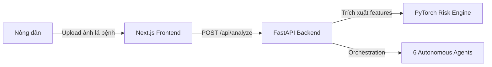

# 📖 Hướng Dẫn Thực Hành: Spec-Driven Development (SDD) với OpenSpec & OpenCode

Tài liệu này hướng dẫn chi tiết cách áp dụng quy trình **Spec-Driven Development (SDD)** kết hợp **OpenSpec** và **OpenCode** vào dự án **CropDoctor AI Platform**. Đây là phương pháp giúp loại bỏ sự mơ hồ trong phát triển phần mềm và đảm bảo tính nhất quán giữa tài liệu thiết kế và code thực tế.

---

## 1. Triết Lý Spec-Driven Development (SDD)

Thay vì lập trình ngay lập tức khi có yêu cầu mới (code-first), SDD yêu cầu đội ngũ phát triển (hoặc AI Agent) phải đi qua quy trình xây dựng đặc tả kỹ thuật và thiết kế kiến trúc trước:

```text
Ý tưởng / Intent 
  ├──► 1. Grill Me (Phỏng vấn làm rõ) 
  ├──► 2. Proposal & Specs (Đề xuất & Đặc tả) 
  ├──► 3. Design (C4 Diagrams & ADR) 
  ├──► 4. Actionable Tasks (Phân rã tác vụ)
  └──► 5. Code Implementation (Viết mã nguồn)
```

Điều này đặc biệt quan trọng trong các dự án AI như **CropDoctor AI**, nơi các luồng tích hợp của 6 Agent cần có giao thức JSON và hợp đồng API cực kỳ chặt chẽ trước khi BE/FE và AI Layer tiến hành code song song.

---

## 2. Cấu Hình Quy Trình "intent-driven" trong Dự Án

Hệ thống đã được thiết lập cấu hình OpenSpec thông qua file [.openspec/config.yaml](file:///C:/Users/Admin/Desktop/github/vietnam-ai-challenge-2026/.openspec/config.yaml) và schema chuyên biệt [.openspec/schemas/intent-driven.yaml](file:///C:/Users/Admin/Desktop/github/vietnam-ai-challenge-2026/.openspec/schemas/intent-driven.yaml).

Schema `intent-driven` bắt buộc quy trình đề xuất phải sinh ra 5 tài liệu/artifact theo đúng thứ tự:
$$\text{Proposal} \rightarrow \text{Specs} \rightarrow \text{Design} \rightarrow \text{ADR} \rightarrow \text{Tasks}$$

---

## 3. Quy Trình 5 Bước Chi Tiết

### Bước 1: Khởi Tạo & Phỏng Vấn (Grill Me)
Trước khi tạo proposal, nhà phát triển (hoặc AI Agent) kích hoạt skill **Grill Me** tại [.agents/skills/grill-me/SKILL.md](file:///C:/Users/Admin/Desktop/github/vietnam-ai-challenge-2026/.agents/skills/grill-me/SKILL.md) để tự phỏng vấn bản thân hoặc người dùng nhằm làm rõ các điểm sau:
- Mục tiêu nghiệp vụ của tính năng là gì?
- Có những ca biên (edge cases) nào cần xử lý?
- Phương án fallback nếu dịch vụ ngoài (như DeepSeek API hoặc Weather API) bị lỗi là gì?

> [!NOTE]
> Chỉ bắt đầu viết tài liệu proposal sau khi đã trả lời đầy đủ các câu hỏi khảo sát từ bước Grill Me.

### Bước 2: Viết Đề Xuất & Đặc Tả (Proposal & Specs)
Tạo tệp proposal và đặc tả kỹ thuật theo đúng cấu trúc schema:
- **Proposal**: Lưu tại `docs/proposals/{change_id}_proposal.md`. Giải thích lý do cần tính năng và các ràng buộc.
- **Specs**: Lưu tại `docs/specs/{change_id}_specs.md`. Định nghĩa các giao thức dữ liệu (như JSON request/response contract của CropDoctor API).

### Bước 3: Thiết Kế Kiến Trúc (C4 Diagrams)
Sử dụng skill **C4 Diagrams** tại [.agents/skills/c4-diagrams/SKILL.md](file:///C:/Users/Admin/Desktop/github/vietnam-ai-challenge-2026/.agents/skills/c4-diagrams/SKILL.md) để mô tả cấu trúc hệ thống:
- Vẽ sơ đồ **System Context** hoặc **Container** bằng Mermaid hoặc ASCII art để thể hiện luồng chạy dữ liệu giữa Next.js Frontend, FastAPI Backend và AI Layer.
- Sơ đồ ví dụ:


### Bước 4: Ghi Lại Quyết Định Kiến Trúc (ADR)
Với mỗi quyết định lớn (ví dụ: *Quyết định sử dụng mô hình pre-trained ResNet-50 trên HuggingFace thay vì tự huấn luyện từ đầu để tối ưu thời gian demo*), sử dụng skill **ADR** tại [.agents/skills/architectural-decision-records/SKILL.md](file:///C:/Users/Admin/Desktop/github/vietnam-ai-challenge-2026/.agents/skills/architectural-decision-records/SKILL.md) để ghi nhận:
- File ADR được lưu trữ lâu dài tại `docs/adr/{adr_id}_adr.md` dưới định dạng MADR.
- Điều này giúp lưu giữ tri thức thiết kế kể cả khi mã nguồn của tính năng bị thay đổi hoặc lưu trữ (archived).

### Bước 5: Phân Tách Tác Vụ (Tasks) & Code
- Lập kế hoạch phân tách công việc rõ ràng tại `docs/tasks/{change_id}_tasks.md`. Mỗi task phải là một đơn vị công việc cực kỳ nhỏ, kiểm thử được (atomic & testable).
- Tiến hành thực thi viết code trên nhánh phát triển hoặc git worktree độc lập.

---

## 4. Kỷ Luật Git Bắt Buộc (Git Discipline)

Dự án áp dụng skill **OpenSpec Git Discipline** tại [.agents/skills/openspec-git-discipline/SKILL.md](file:///C:/Users/Admin/Desktop/github/vietnam-ai-challenge-2026/.agents/skills/openspec-git-discipline/SKILL.md) với quy tắc cốt lõi:

> [!IMPORTANT]
> **Mọi thay đổi trạng thái OpenSpec phải đi qua branch `main` trước khi giai đoạn tiếp theo được thực thi.**

- **Trước khi Code (propose -> apply)**: Tất cả các file Proposal, Specs, Design và ADR phải được phê duyệt và **merge vào branch `main`** trước.
- **Trong khi Code (apply)**: Việc viết code phải được thực hiện trên các nhánh feature riêng (hoặc Git Worktree riêng) để đảm bảo không xung đột và không làm hỏng code chạy ổn định trên `main`.
- **Sau khi hoàn thành (apply -> archive)**: Code chạy ổn định và vượt qua test phải được **merge về `main`**, sau đó mới thực hiện lệnh `archive` để dọn dẹp các tệp tạm của OpenSpec.

---

## 5. Hướng Dẫn CLI OpenSpec

Khi làm việc với các câu lệnh CLI của OpenSpec (hoặc mô phỏng quy trình):

```bash
# 1. Khởi tạo OpenSpec
openspec init

# 2. Đề xuất tính năng mới (Tự động kích hoạt Grill Me -> Proposal -> Specs)
openspec propose --id "CD-001" --title "tich-hop-grad-cam"

# 3. Tiếp tục thiết kế và ADR
openspec continue --id "CD-001"

# 4. Bắt đầu áp dụng code (Tạo feature branch/worktree)
openspec apply --id "CD-001"

# 5. Xác minh kết quả (Chạy smoke test & eval)
openspec verify --id "CD-001"

# 6. Lưu trữ và merge về main
openspec archive --id "CD-001"
```

Áp dụng quy trình SDD chuẩn mực sẽ giúp dự án **CropDoctor AI** đạt điểm số tối đa về tính chuyên nghiệp kỹ thuật, khả năng cộng tác nhóm và kiểm soát rủi ro trong buổi chấm thi live demo!
