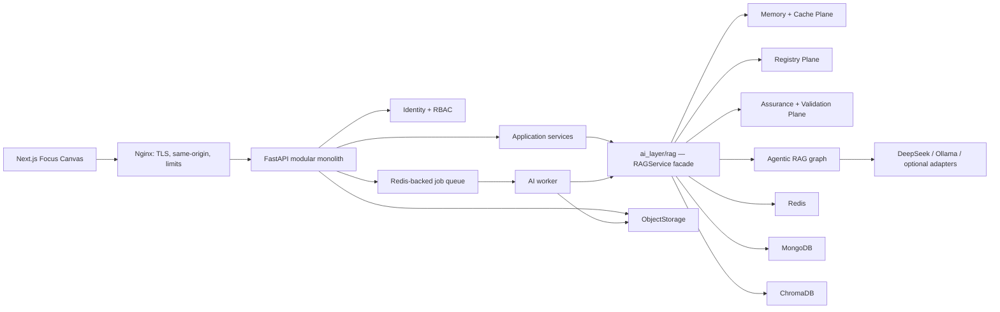
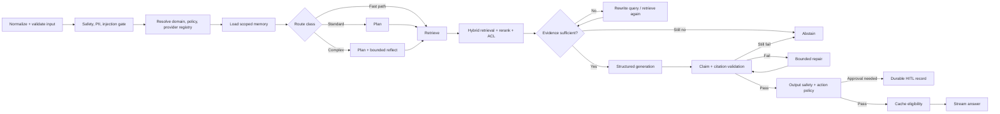

# AI-Native Production Platform — Design Specification

**Ngày:** 2026-07-10

**Trạng thái:** Kiến trúc v2 đã được duyệt; đặc tả chờ duyệt cuối

**Phạm vi:** Backend, frontend Focus Canvas, `ai_layer/rag`, security, deployment, testing và observability

**Chiến lược:** Strangler migration trên modular monolith hiện tại

## 1. Executive summary

Nền tảng được harden theo hướng production cho một deployment single-tenant Docker/VPS dùng trong cuộc thi, nhưng mọi contract quan trọng đều giữ `domain_id` và `tenant_id` để không khóa đường nâng cấp SaaS sau này.

Không rewrite toàn bộ hệ thống. Các module nghiệp vụ hiện có được giữ lại phía sau application services và compatibility adapters. Backend FastAPI chỉ giao tiếp với AI qua facade `ai_layer.rag.service.RAGService`; không được import trực tiếp ChromaDB, LangGraph, embedding model hoặc provider SDK.

AI Copilot sử dụng giao diện Focus Canvas và nhận kết quả qua typed streaming contract. Agentic RAG được bao quanh bởi ba lớp phòng thủ cấp một nằm hoàn toàn trong `ai_layer/rag`:

1. **Memory + Cache Plane:** lưu đúng scope, có trust, provenance, version và expiry.
2. **Registry Plane:** quản lý capability, adapter, prompt, tool, policy và evaluator bằng manifest có version.
3. **Assurance + Validation Plane:** kiểm tra input, retrieval evidence, claim/citation, output và action policy; thiếu bằng chứng thì abstain.

DeepSeek là provider production chính. Ollama là local/offline fallback có policy kiểm soát. OpenAI và Gemini là adapter tùy chọn, không phải dependency bắt buộc của core.

## 2. Mục tiêu

### 2.1 Mục tiêu bắt buộc

- Chạy ổn định bằng Docker Compose trên một VPS Linux với TLS và persistent volumes.
- Có authentication, refresh-token rotation, RBAC và audit trail.
- Biến `ai_layer/rag` thành một module độc lập, có typed boundary và có thể kiểm thử riêng.
- RAG trả lời dựa trên evidence có provenance; không đủ evidence phải abstain.
- Conversation memory không được sử dụng thay knowledge-base evidence.
- Cache không phục vụ lại answer lỗi thời hoặc answer chưa qua validation.
- Domain pack được resolve theo từng request; không có global active domain.
- Focus Canvas có streaming, citation, approval, degraded và abstain state hoàn chỉnh.
- Có CI gates cho backend, frontend, AI evaluation và container smoke test.
- Có trace xuyên suốt từ UI đến provider, retrieval, validator, cache và worker.

### 2.2 Non-goals của release đầu

- Chưa cung cấp public signup hoặc self-service tenant administration.
- Chưa triển khai Kubernetes, active-active database hoặc multi-region failover.
- Chưa cam kết multi-tenant SaaS hoàn chỉnh; chỉ bảo toàn tenant-ready contracts và metadata.
- Không cố tạo một LLM “không bao giờ sai”. Mục tiêu là phát hiện, giới hạn, đo lường và chặn rủi ro.
- Không thay thế ngay toàn bộ route cũ; route cũ đi qua compatibility adapter trong giai đoạn migration.

## 3. Các quyết định đã chốt

| Mảng | Quyết định |
|---|---|
| Deployment | Single-tenant Docker/VPS trước, SaaS-friendly về contract |
| Backend | FastAPI modular monolith, migration theo Strangler pattern |
| Frontend | Next.js, Focus Canvas chat-first |
| Auth | Admin-created users; `admin`, `expert`, `operator` |
| AI providers | DeepSeek primary, Ollama local fallback, OpenAI/Gemini optional |
| Business data | MongoDB |
| Vector database | Persistent ChromaDB |
| Cache/queue | Redis |
| File storage | `ObjectStorage` interface; local volume trước, S3/MinIO sau |
| RAG ownership | Toàn bộ RAG, memory, cache, registry và validation nằm trong `ai_layer/rag` |
| Risk handling | Retry có giới hạn, rewrite, retrieval lại, cuối cùng abstain |

## 4. Kiến trúc tổng thể



### 4.1 Runtime components

- **Nginx:** TLS termination, same-origin routing, request-size limit, security headers và reverse proxy.
- **Next.js:** Focus Canvas, operations views, authentication shell và typed API client.
- **FastAPI:** identity, policy, session, diagnosis, approvals, storage, jobs và compatibility routes.
- **AI worker:** ingestion, embedding, re-index, long-running vision inference và offline evaluation.
- **Redis:** working memory, bounded caches, rate limit, distributed locks và background job transport.
- **MongoDB:** users, refresh sessions, conversations, long-term facts, cases, approvals, audit, job metadata và version records.
- **ChromaDB:** vector chunks có domain/tenant/document/index metadata.
- **ObjectStorage:** source documents và artifacts; local persistent volume trong release đầu.

### 4.2 Backend module boundary

```text
backend/app/
├── auth/
├── copilot/
├── domains/
├── diagnosis/
├── approvals/
├── storage/
├── jobs/
├── observability/
└── compatibility/
```

Backend chỉ được gọi ba operation của AI facade:

```python
RAGService.ask(request: CopilotRequest) -> CopilotAnswer
RAGService.stream(request: CopilotRequest) -> AsyncIterator[CopilotEvent]
RAGService.ingest(request: IngestionRequest) -> JobReference
```

Import trực tiếp từ backend vào `vectorstores`, `providers`, `agentic`, `embeddings` hoặc SDK bên thứ ba là vi phạm kiến trúc.

## 5. AI Layer package design

```text
ai_layer/
├── rag/
│   ├── service.py
│   ├── contracts/
│   ├── agentic/
│   ├── memory/
│   ├── cache/
│   ├── registries/
│   ├── validation/
│   ├── ingestion/
│   ├── retrieval/
│   ├── generation/
│   ├── providers/
│   ├── embeddings/
│   ├── vectorstores/
│   ├── evaluation/
│   └── observability/
├── cropdoctor/
├── pytorch_engine/
└── guardrails/
```

`cropdoctor` và `pytorch_engine` có thể cung cấp tool/capability cho RAG qua registries. RAG không gọi chéo bằng import tùy tiện; adapter phải đăng ký typed capability.

## 6. Agentic RAG lifecycle



### 6.1 Bounded behavior

- Planner tối đa một plan cho mỗi attempt.
- Reflect/retrieve loop mặc định tối đa hai vòng và cấu hình được theo domain policy.
- Provider retry chỉ áp dụng lỗi transient, có exponential backoff và jitter.
- Validation repair tối đa một lần cho fast/standard path, hai lần cho high-risk path.
- Chạm retry budget phải chuyển sang degraded hoặc abstain; không loop vô hạn.
- Mọi node phải nhận và trả typed state, không truyền dictionary không kiểm soát.

## 7. Memory Plane

### 7.1 Các lớp memory

1. **Conversation event log — MongoDB**
   - Lưu message, event, tool call, citation, approval state và version metadata.
   - Append-only về mặt audit; chỉnh sửa hiển thị tạo event mới thay vì ghi đè lịch sử.
   - Mỗi event có `session_id`, `user_id`, `domain_id`, `tenant_id`, `sequence`, `trace_id`.

2. **Working memory — Redis**
   - Recent N turns và rolling summary.
   - TTL cấu hình theo domain; mặc định 24 giờ cho cache working set, dữ liệu gốc vẫn ở MongoDB.
   - Cache key bắt buộc có tenant, user, session và conversation revision.

3. **Long-term user facts — MongoDB**
   - Chỉ lưu field nằm trong allowlist của domain pack.
   - Mỗi fact có `value`, `source_message_id`, `trust_level`, `consent`, `created_at`, `expires_at` và `status`.
   - Fact nhạy cảm hoặc ảnh hưởng hành động phải được người dùng xác nhận trước khi active.
   - Fact bị document/user correction phủ định phải được supersede, không âm thầm xóa audit.

### 7.2 Quy tắc chống memory poisoning

- Retrieved document và tool output không được tự động ghi thành user fact.
- Instruction chứa trong document luôn được coi là untrusted data.
- Memory write phải qua schema validation, allowlist, PII policy và provenance check.
- Không cho model tự đặt `trust_level=trusted`.
- Memory từ session khác không được truy cập nếu không cùng user/tenant và policy cho phép.
- User có API xem, sửa và quên long-term memory của chính họ; admin action được audit.

### 7.3 Nguyên tắc bất biến

> Memory giúp hiểu hội thoại; memory không phải bằng chứng chuyên môn.

Mọi factual claim về nghiệp vụ/chẩn đoán vẫn cần knowledge-base citation hoặc typed tool evidence. Memory không được tính vào citation coverage.

## 8. Cache Plane

### 8.1 Cache tách theo mục đích

- **Embedding cache:** normalized input hash + embedding model revision.
- **Retrieval cache:** normalized query + domain/tenant scope + index revision + retriever/reranker version.
- **Provider capability cache:** model list/health trong TTL ngắn.
- **Response cache:** chỉ dùng cho query đủ điều kiện và answer đã vượt toàn bộ validator.

### 8.2 Response cache key

Cache key tối thiểu gồm:

```text
tenant_scope
domain_pack_version
knowledge_index_revision
prompt_version
policy_version
provider_id
model_revision
validator_bundle_version
normalized_query_hash
memory_scope_or_stateless_marker
```

Conversation-dependent answer phải có `session_id` và `conversation_revision`, vì vậy không được chia sẻ semantic response cache giữa người dùng. Public/stateless domain query mới đủ điều kiện dùng semantic cache rộng hơn.

### 8.3 Không được cache

- Error, timeout, partial stream hoặc provider-degraded answer chưa hoàn tất.
- Answer có PII hoặc sensitive user context.
- High-risk diagnosis/action, answer có `approval_required=true`.
- Answer bị abstain do thiếu evidence hoặc validation failure.
- Answer chưa đạt citation coverage/policy threshold.

### 8.4 Invalidation

- Re-index thành công tạo `knowledge_index_revision` mới rồi atomic switch; revision cũ không còn được lookup.
- Prompt, policy, domain pack, model hoặc validator thay version làm cache cũ tự mất hiệu lực do key versioned.
- Xóa/supersede document phải phát event invalidation và đóng revision liên quan.
- TTL chỉ là lớp bảo vệ bổ sung, không thay thế revision-based invalidation.

## 9. Registry Plane

Các registry bắt buộc:

- `DomainRegistry`
- `ProviderRegistry`
- `ModelRegistry`
- `PromptRegistry`
- `ToolRegistry`
- `EmbeddingRegistry`
- `RetrieverRegistry`
- `RerankerRegistry`
- `VectorStoreRegistry`
- `ParserRegistry`
- `ChunkerRegistry`
- `GuardrailRegistry`
- `EvaluatorRegistry`

Mỗi registration có:

```text
id, version, capabilities, supported_domains,
config_schema, healthcheck, lifecycle, risk_class
```

Startup validation phải fail-fast khi:

- Trùng `id + version`.
- Domain pack tham chiếu capability không tồn tại.
- Config không hợp schema.
- Provider/model bắt buộc không có credential hoặc healthcheck thất bại ở readiness mode.
- Prompt/tool output schema không tương thích với consuming node.

Registry được resolve theo request context; không có mutable global active domain/provider. Singleton immutable catalog được phép nếu content không thay đổi sau startup.

## 10. Assurance + Validation Plane

### 10.1 Input validation

- Pydantic contract, length/rate limit và canonical normalization.
- MIME/magic-number validation cho upload; filename không được quyết định storage path.
- PII/sensitive data detection theo domain policy.
- Prompt-injection classification và instruction-boundary enforcement.
- Retrieved content được đặt trong delimiter/data channel rõ ràng, không nối trực tiếp vào system instruction.

### 10.2 Retrieval quality gate

- Hybrid dense + lexical retrieval.
- Initial lexical adapter là persistent local BM25 index theo domain; interface cho phép đổi sang OpenSearch/managed search sau này.
- Metadata filter bắt buộc: tenant, domain, document status và active index revision.
- Reranking dùng adapter có version.
- Evidence gate xét min score, source diversity, freshness và contradiction signal.
- Một source lặp nhiều chunk không được tính thành source diversity.

### 10.3 Claim and citation validation

- Citation ID phải tồn tại trong retrieval set của chính request.
- Citation phải thuộc đúng tenant/domain/index revision.
- Citation span/checksum phải map ngược về source document.
- Factual claim phải đạt citation coverage threshold.
- Deterministic validator kiểm tra existence, scope, schema và coverage trước.
- NLI/small-model hoặc LLM support grader chỉ chạy khi deterministic signal không đủ hoặc policy xếp query vào high-risk.
- Validator model không tự được coi là ground truth; verdict và disagreement được log để đánh giá offline.

### 10.4 Output and action policy

- Output phải parse được bằng JSON Schema/Pydantic trước khi render.
- Safety status, citations, suggested actions và approval phải là field typed.
- Action có side effect phải đi qua `ActionPolicy`.
- High-risk action tạo durable approval record; worker không thực thi trước quyết định của role được phép.
- Validation failure đi theo `repair → retrieve/rewrite → abstain`, không silent pass.

## 11. Latency và cost architecture

Không phải validator nào cũng gọi LLM. Pipeline áp dụng cost ladder:

1. **Tier 0 — deterministic:** schema, ACL, checksums, citation existence, thresholds, rate/policy rules.
2. **Tier 1 — local/small model:** classification, lightweight relevance/NLI khi cần.
3. **Tier 2 — primary model:** generation và complex validation có điều kiện.
4. **Tier 3 — escalation:** chỉ dành cho high-risk query hoặc validator disagreement.

### 11.1 Routing paths

- **Fast path:** FAQ/single-hop, không tool side effect, retrieval rõ ràng. Bỏ planner/reflector nhưng không bỏ input safety, evidence, citation và output policy gates.
- **Standard path:** planner đơn giản, một retrieval pass và bounded repair.
- **Complex/high-risk path:** multi-step/tool planning, reflect tối đa hai vòng, validation mạnh và có thể yêu cầu HITL.

### 11.2 Parallel execution

Sau input gate, các operation độc lập được phép chạy song song:

- Registry/domain resolution, scoped memory load và provider health snapshot.
- Dense query embedding và lexical query preparation.
- Sau generation: citation existence/coverage, output schema check và action classification.

Không chạy song song nếu làm sai dependency hoặc có thể gửi dữ liệu chưa qua safety gate đến external provider.

### 11.3 Performance budgets

Mục tiêu release đầu, đo ở p95 khi hệ thống warm:

- Non-AI API: dưới 300 ms.
- Fast-path first token: dưới 2.5 giây.
- Standard-path first token: dưới 5 giây.
- Standard answer hoàn tất: dưới 12 giây, không gồm upload/ingestion job.
- Cache hit phải được trả trong dưới 500 ms nhưng vẫn qua scope/policy check.
- Mỗi domain có token/cost budget; vượt budget phải degrade hoặc abstain, không âm thầm tăng chi phí.

## 12. Abstain và graceful fallback contract

`CopilotAnswer.status` có bốn trạng thái:

```text
answered | abstained | approval_required | error
```

Abstain không phải infrastructure error. Contract:

```json
{
  "status": "abstained",
  "answer": null,
  "abstention": {
    "code": "INSUFFICIENT_EVIDENCE",
    "user_message": "Tôi chưa có đủ nguồn đáng tin cậy để kết luận.",
    "attempted_sources": 4,
    "recovery_actions": ["refine_question", "upload_document", "ask_expert"],
    "expert_handoff_available": true
  },
  "citations": [],
  "trace_id": "..."
}
```

Các `abstention.code` chuẩn:

- `INSUFFICIENT_EVIDENCE`
- `CONFLICTING_EVIDENCE`
- `OUT_OF_DOMAIN`
- `POLICY_BLOCKED`
- `PROVIDER_UNAVAILABLE`
- `VALIDATION_FAILED`

Focus Canvas hiển thị abstain bằng neutral evidence state, không dùng giao diện lỗi đỏ. UI phải:

- Nói rõ hệ thống chưa thể kết luận, không đổ lỗi kỹ thuật cho người dùng.
- Cho biết số nguồn/không gian đã tìm nếu policy cho phép.
- Đưa tối đa ba bước tiếp theo phù hợp: sửa câu hỏi, thêm tài liệu, chuyển chuyên gia.
- Giữ nguyên nội dung người dùng đã nhập.
- Cho phép expert handoff tạo case có transcript, evidence và trace ID.

Infrastructure `error` dùng UI khác, có retry và support trace ID.

## 13. Copilot API và streaming contract

Endpoint chính:

```http
POST /api/v1/copilot/sessions/{session_id}/messages
Accept: text/event-stream
Authorization: Bearer <access-token>
Idempotency-Key: <uuid>
Last-Event-ID: <event-id>  # chỉ gửi khi reconnect
```

Request mang `expected_conversation_revision`. Backend append message và tăng revision bằng atomic compare-and-set; revision mismatch trả `409 CONVERSATION_REVISION_CONFLICT` để client đồng bộ lại, không âm thầm trộn hai nhánh hội thoại.

SSE event types:

```text
message.started
route.selected
memory.loaded
retrieval.completed
token.delta
citation.added
approval.required
message.abstained
message.completed
error
```

Mọi `CopilotEvent` có `event_id`, `sequence`, `message_id`, `occurred_at`, `trace_id` và typed `payload`. Khi mất kết nối, frontend gửi lại cùng `Idempotency-Key` và `Last-Event-ID`; backend phải nối vào execution cũ hoặc replay phần còn lại, không tạo message/model call mới. Active token deltas được giữ trong Redis với TTL ngắn; final answer và các coarse lifecycle event được lưu trong MongoDB để phục hồi sau restart.

Event nội bộ như raw chain-of-thought không được stream ra client. `route.selected` và trace chỉ chứa trạng thái vận hành an toàn, không chứa reasoning bí mật.

Final answer schema tối thiểu:

```text
message_id
status
answer
citations[]
confidence_band
safety_status
suggested_actions[]
approval
abstention
trace_id
versions {
  domain_pack, knowledge_index, prompt,
  policy, provider_model, validator_bundle
}
```

`confidence_band` là `low | medium | high` được suy ra từ evidence/validator metrics, không lấy trực tiếp từ tự đánh giá của LLM.

## 14. Authentication, authorization và audit

### 14.1 Identity

- Không public signup.
- Admin tạo, khóa, reset user.
- Password hash bằng Argon2id.
- Access JWT sống 15 phút, chỉ giữ trong memory của frontend.
- Refresh token là opaque random token, lưu hash trong MongoDB, cookie `HttpOnly`, `Secure`, `SameSite=Strict`, sống tối đa 7 ngày.
- Refresh token rotation và reuse detection; reuse làm revoke token family.
- Refresh/logout kiểm tra `Origin` và same-origin deployment.

### 14.2 Roles

| Capability | admin | expert | operator |
|---|:---:|:---:|:---:|
| Quản lý user/domain config | ✓ |  |  |
| Ingest/re-index knowledge | ✓ | giới hạn |  |
| Xem agent trace/evaluation | ✓ | ✓ | giới hạn |
| Duyệt high-risk recommendation | ✓ | ✓ |  |
| Sử dụng Copilot/case workflow | ✓ | ✓ | ✓ |

Authorization bắt buộc ở backend dependency/policy layer; ẩn button trên UI không được coi là security control.

### 14.3 Audit

Audit các event: login, refresh reuse, user/role change, upload, index activation, memory change, approval decision, tool side effect, policy/config version change. Audit record không chứa raw secret hoặc full sensitive prompt mặc định.

## 15. Provider gateway

- OpenAI-compatible internal interface cho chat/embedding khi capability tương thích.
- DeepSeek primary với timeout, retry policy và circuit breaker.
- Ollama fallback chỉ dùng khi domain/task policy cho phép và model đáp ứng capability/schema.
- Fallback phải set `degraded=true` và version metadata; không giả vờ cùng chất lượng.
- Optional OpenAI/Gemini adapters đăng ký qua `ProviderRegistry`.
- Secret chỉ đến từ environment/secret store; không commit `.env`.
- Log redaction trước khi ghi provider request metadata.
- Không tự động fallback high-risk task sang model yếu hơn nếu policy không cho phép; trường hợp đó abstain `PROVIDER_UNAVAILABLE`.

## 16. Ingestion và provenance

Ingestion là background job:

```text
upload → malware/type/size validation → object storage
→ parse → normalize → chunk → metadata validation
→ embed → dense index + lexical index
→ retrieval smoke test → atomic index revision activation
```

Quy tắc:

- File content checksum tạo idempotency key.
- Parser/chunker/embedding version được lưu với mỗi index revision.
- Chunk có `chunk_id`, `document_id`, `source_uri`, `page/section`, checksum, tenant/domain, document version, index revision và status.
- Không activate partial index.
- Re-index thất bại giữ revision cũ hoạt động.
- Xóa source dùng tombstone + re-index; audit và retention policy xử lý physical deletion.
- Object storage path do server tạo, không dùng raw filename.

## 17. Focus Canvas frontend

### 17.1 Desktop

- Slim conversation/workspace rail bên trái.
- Message canvas là surface chính, rộng và thoáng.
- Evidence/action panel bên phải, collapsible; citation click mở đúng source span.
- Agent trace, ingestion, evaluation và expert operations nằm ở màn hình riêng, không làm chat quá tải.

### 17.2 Mobile

- Strict single-column.
- Conversation rail và evidence panel trở thành drawer/sheet.
- Composer sticky nhưng không che content hoặc safe area.

### 17.3 Visual language

- Một emerald accent, nền trung tính, không dùng “AI purple”.
- Sans typography rõ ràng, hierarchy dựa vào scale/spacing thay vì nhiều card.
- Motion vừa phải, tôn trọng `prefers-reduced-motion`.
- Không dùng emoji thay icon; icon có accessible label/tooltip.
- Loading, streaming, empty, degraded, approval, abstain và error state phải được thiết kế riêng.

### 17.4 Frontend package boundary

```text
frontend/src/features/copilot/
├── CopilotShell
├── ConversationRail
├── MessageList
├── MessageBubble
├── EvidencePanel
├── ApprovalAction
├── AbstentionState
├── CopilotComposer
├── useCopilotStream
└── copilot.types
```

## 18. Error model và reliability

Typed API error:

```json
{
  "code": "PROVIDER_TIMEOUT",
  "message": "Dịch vụ AI đang phản hồi chậm.",
  "trace_id": "...",
  "retryable": true
}
```

- Idempotency key bắt buộc cho message creation, ingestion và side-effect action.
- Cùng `Idempotency-Key` và request hash phải trả cùng operation; cùng key nhưng khác payload trả `409 IDEMPOTENCY_CONFLICT`.
- Conversation append dùng monotonic revision/optimistic concurrency để ngăn lost update giữa nhiều tab.
- Streaming reconnect phải resume execution hoặc trả final snapshot; không được chạy lại provider chỉ vì client mất mạng.
- Worker job có max attempts, backoff, dead-letter state và admin retry.
- Approval state bền vững trong MongoDB; process restart không làm mất pending approval.
- `/health/live` chỉ kiểm tra process loop.
- `/health/ready` kiểm tra dependency bắt buộc và registry readiness; optional provider failure trả degraded metadata theo policy.
- Graceful shutdown ngừng nhận job mới, hoàn tất/return job lease và đóng connections.

## 19. Observability

Mỗi request có `trace_id` xuyên frontend → API → RAG nodes → provider/DB → worker.

Structured logs/trace phải có:

- route class và latency mỗi node;
- model/provider/version và token/cost metadata;
- memory read/write decision, không log raw sensitive value;
- cache key class, hit/miss/invalidation reason;
- registry versions;
- retrieval scores, source diversity và active index revision;
- validator verdict, repair/abstain reason;
- approval/action state.

Metrics tối thiểu:

- request/error/abstain/approval rate;
- p50/p95 first-token và completion latency;
- cache hit ratio theo cache class;
- provider timeout/fallback/circuit state;
- retrieval zero-result và evidence-gate failure rate;
- citation coverage/support pass rate;
- queue depth, retry, dead-letter và ingestion duration;
- token và estimated cost theo domain/model.

Không thu thập chain-of-thought. Prompt/response logging mặc định redacted và có retention policy.

## 20. Testing và AI evaluation

### 20.1 Deterministic tests

- Unit tests: contracts, registry fail-fast, memory scope, cache key/invalidation, validators, RBAC, token rotation.
- Integration tests: MongoDB, Redis, ChromaDB, ObjectStorage, provider stub và worker retry.
- Contract tests: SSE order, reconnect/idempotency, answer/abstain/approval/error schemas.
- Security tests: cross-tenant/domain isolation, upload traversal/type spoofing, refresh reuse, unauthorized approval.
- Frontend tests: component states, keyboard flow, streaming reducer và accessibility.
- Playwright: login → Copilot → citation → abstain → expert handoff → approval.
- Container smoke: fresh `docker compose up`, readiness, seed admin, ingest fixture, ask fixture.

### 20.2 Evaluation gates

Mỗi domain pack có golden set với answerable, unanswerable, adversarial injection, conflicting evidence và high-risk cases.

Theo dõi:

- retrieval recall@k;
- citation precision và claim support;
- unsupported-claim rate;
- abstain precision/recall;
- policy violation rate;
- latency và token/cost regression.

LLM-as-judge chỉ là một signal offline, phải lưu judge model/prompt version và được kiểm tra bằng labeled subset. Không dùng một judge duy nhất làm runtime ground truth.

CI fail khi:

- contract/unit/integration/security test fail;
- unsupported-claim hoặc policy regression vượt threshold của domain;
- unanswerable set không abstain đạt ngưỡng;
- schema hoặc registry manifest không hợp lệ;
- frontend type-check/lint/build fail.

## 21. Deployment và operations

Docker Compose production gồm:

```text
nginx
frontend
backend
worker
redis
mongodb
chromadb
```

- Persistent volumes cho MongoDB, ChromaDB, Redis persistence và local ObjectStorage.
- Migrations/index bootstrap là command riêng, idempotent.
- Backup MongoDB, Chroma/index artifacts, object storage và config/version manifests.
- Restore drill phải được kiểm tra trước release.
- `.env.example` chỉ có placeholder; startup fail với secret bắt buộc bị thiếu.
- CORS allowlist same-origin, `DEMO_MODE=false`, debug docs có policy riêng.
- Rate limits khác nhau cho auth, chat, upload và admin operations.
- Security headers: CSP phù hợp, HSTS, `X-Content-Type-Options`, frame policy và referrer policy.

## 22. Migration strategy

1. **Foundations:** contracts, config validation, test harness, CI, container health.
2. **Identity/security:** users, JWT/refresh rotation, RBAC, CORS/upload hardening, audit.
3. **AI core:** `RAGService`, registries, memory/cache, validation, provider gateway và trace.
4. **Knowledge:** versioned ingestion, hybrid retrieval, provenance và evaluation fixtures.
5. **Copilot:** SSE endpoint, Focus Canvas, citations, abstain, approval và degraded UX.
6. **Operations:** worker dashboard, ingestion/evaluation views, metrics và backup/restore.
7. **Cutover:** compatibility adapters route dần sang core mới; xóa legacy chỉ sau parity tests.

Mỗi bước phải giữ application chạy được. Không xóa hoặc rewrite các thay đổi RAG hiện tại trước khi có characterization tests.

## 23. Production readiness gates

Release chỉ được gọi là production-ready khi:

- Fresh clone có thể build/test/run bằng documented commands.
- Không bỏ qua TypeScript errors; type-check, lint, formatting và build đều pass.
- Backend dependency lock/reproducible environment hoạt động, không phụ thuộc broken local venv.
- Không còn unauthenticated state-changing endpoint.
- Secret, CORS, upload, rate limit và security headers đạt policy.
- RAG facade là boundary duy nhất từ backend.
- Memory/cache isolation và invalidation tests pass.
- Golden set đạt threshold đã version hóa cho domain release.
- Abstain, approval, degraded và error UX được E2E test.
- Có metrics, structured logs, trace correlation và alert/runbook cơ bản.
- Backup/restore và container restart không làm mất durable state.
- Không có blocker P0/P1 mở trong release checklist.

## 24. Design invariants

Các invariant sau không được đánh đổi trong implementation:

1. `Memory != Evidence`.
2. Không có mutable global active domain.
3. Backend không bypass `RAGService`.
4. Không cache answer chưa qua validator.
5. Không execute high-risk side effect trước durable approval.
6. Không stream chain-of-thought.
7. Không silent fallback sang model yếu hơn cho task policy không cho phép.
8. Thiếu evidence hoặc validation không chắc chắn phải repair có giới hạn hoặc abstain.
9. Mọi answer có thể truy về domain, knowledge, prompt, policy, model và validator version.
10. Legacy chỉ bị xóa sau characterization/parity tests.

## 25. Acceptance of this specification

Sau khi đặc tả này được duyệt, implementation plan phải chia thành task nhỏ theo TDD, ghi rõ file path, test command, expected behavior và migration checkpoint. Việc triển khai không được mở rộng ngoài scope nếu chưa cập nhật lại đặc tả.
