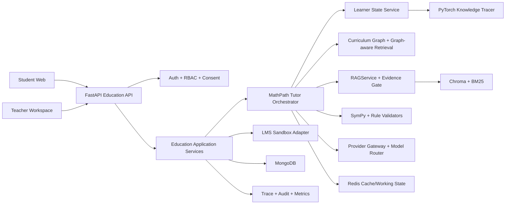

## Context

### Nguồn yêu cầu và tiêu chí thành công

Thiết kế này hiện thực hóa đề mô phỏng `docs/VAIC_2026_De_Bai_Giao_Duc_AI_MathPath_THPT.docx`. Sản phẩm phục vụ học sinh lớp 10-12, giáo viên Toán và quản trị viên; MVP tập trung lớp 10-11, hai mạch Đại số và Giải tích. Bốn release gate của đề được giữ nguyên:

1. F1 chẩn đoán nút kiến thức/lỗ hổng và nhóm sai lầm trên tối thiểu 60 ca đạt `>= 0,85`.
2. Độ đúng lời giải/phản hồi Toán trên 80 bài đạt `>= 90%`; kết luận đại số/giải tích phù hợp phải có math-tool evidence.
3. Thời gian giáo viên tổng hợp lớp và tạo kế hoạch phân hóa giảm `>= 50%` trong bài đo ba giáo viên.
4. `>= 80%` học sinh user-test hoàn thành chuỗi gợi mở mà không bị lộ đáp án ngay; mức hữu ích trung bình `>= 4/5`.

Các ràng buộc khác gồm web/mobile tiếng Việt, hai vai trò học sinh/giáo viên, curriculum graph tối thiểu 40 nút và hai mạch, 30 học sinh synthetic, năm hành trình demo, LMS Sandbox tối thiểu ba endpoint, audit/trace, quyền riêng tư trẻ vị thành niên, human-in-the-loop và mục tiêu độ trễ dưới 5 giây cho gợi ý đơn giản, dưới 12 giây cho tác vụ nhiều bước.

### Hiện trạng có thể tái sử dụng

| Lớp | Hiện có | Khoảng trống MathPath |
|---|---|---|
| Frontend | Next.js 16, React 19, auth shell, Focus Canvas, SSE reducer, Knowledge Base, AI Operations, responsive design | Route/copy/domain bị khóa nông nghiệp; chưa có practice stepper, math input, learning path, teacher heatmap/intervention |
| Backend | FastAPI modular monolith, JWT/refresh, RBAC, MongoDB schema, Redis, worker, approvals, idempotency, SSE Copilot | Schema nghiệp vụ còn nông nghiệp; chưa có class/skill/attempt/learner state/assignment/LMS API |
| AI core | `RAGService`, memory/cache, registries, hybrid retrieval scaffolding, citations, abstention, provider gateway, evaluation | FPT prompt hard-code nông nghiệp; agent graph mới chủ yếu retrieve/reflect; chưa có pedagogy state, graph retrieval, math tool |
| Model | `ImpactTriageNet`, train/evaluate/export/benchmark scaffolding | Chưa mô hình hóa chuỗi attempt, mastery vector, prerequisite gap hoặc misconception MathPath |
| Hạ tầng | Nginx, frontend, backend, worker, MongoDB, Redis, Chroma, Docker Compose | Chưa có education seed, backup/demo profile, external LMS resilience và release scorecard MathPath |

Worktree đang có nhiều thay đổi chưa commit. Implementation phải thêm vertical slice mới, không reset/rewrite các thay đổi hiện hữu và không xóa domain nông nghiệp cho tới khi parity tests qua.

### Stakeholders

- Học sinh: cần gợi mở đúng mức, không bị gắn nhãn cố định, xem được tiến bộ và quyền dữ liệu.
- Giáo viên: cần insight có bằng chứng, drill-down được, chỉnh/duyệt trước khi giao can thiệp.
- Tổ chuyên môn/quản trị: cần cấu hình curriculum pack, kiểm tra nguồn, metric và audit.
- Đội thi/vận hành: cần demo ổn định, chạy được khi provider/LMS chập chờn và đo được tác động.

## Goals / Non-Goals

**Goals:**

- Tạo một vertical slice hoàn chỉnh: học sinh làm sai một bước -> hệ thống kiểm chứng -> chẩn đoán lỗ hổng -> đưa gợi ý Socratic -> cập nhật learner state -> giáo viên thấy insight và duyệt worksheet.
- Tái sử dụng kiến trúc AI-native hiện tại qua `domain_id=education-mathpath`, không dựng một ứng dụng hoặc RAG stack song song.
- Phân tách rõ bốn nguồn năng lực: LLM giao tiếp/lập kế hoạch; RAG cung cấp căn cứ; PyTorch/knowledge tracing tạo tín hiệu định lượng; SymPy/rule engine kiểm chứng toán.
- Đưa toàn bộ metric của đề vào test/evaluation/release gates có output máy đọc được.
- Có MVP thi đấu trong 48 giờ và đường nâng cấp thành pilot 8 tuần cho 500 học sinh, 20 giáo viên, 5 trường.

**Non-Goals:**

- Không tự động chấm điểm chính thức, xếp loại hoặc gửi thông báo tiêu cực cho phụ huynh/học sinh.
- Không huấn luyện/fine-tune foundation LLM từ dữ liệu học sinh; không gửi hồ sơ định danh sang provider ngoài.
- Không bắt buộc OCR viết tay trong MVP; OCR là P1 sau khi core benchmark đã qua.
- Không đưa Neo4j, Kubernetes, microservices hoặc data lake vào MVP. Graph 40-120 nút được lưu/version trong JSON + MongoDB và truy vấn bằng adjacency service.
- Không xây LMS đầy đủ; chỉ cung cấp adapter/sandbox sync theo contract của đề.
- Không hứa mọi bài Toán đều kiểm chứng được. Bài ngoài capability phải trả trạng thái `unverified/abstained`, không suy đoán.

## Decisions

### 1. Chọn vertical slice trên modular monolith thay vì rewrite

**Quyết định:** giữ Next.js + FastAPI + `ai_layer/rag` + MongoDB/Redis/Chroma; thêm bounded context `education` và Domain Pack `education-mathpath`.

**Các phương án đã cân nhắc:**

- **A - Domain Pack vertical slice (chọn):** nhanh nhất để tận dụng auth, SSE, RAG, approval, audit, worker và Docker hiện có; rủi ro chính là phải gỡ các hard-code nông nghiệp.
- **B - Ứng dụng MathPath mới:** domain sạch hơn nhưng lặp lại hạ tầng và không kịp chứng minh production readiness.
- **C - Overlay demo/hard-coded:** nhanh nhưng vi phạm yêu cầu AI thật, learner state và tool calling.

Ranh giới implementation:

```text
frontend/src/features/education/*
backend/app/education/*
ai_layer/mathpath/*
domains/education-mathpath/*
```

Backend chỉ gọi AI qua `RAGService` hoặc `MathPathTutorService`; service này composition-root các capability của `ai_layer/rag`, không import provider/vector SDK trực tiếp từ route.

### 2. Kiến trúc tổng thể và data flow



Luồng attempt chuẩn:

1. API xác thực student, session và ownership; chuẩn hóa LaTeX/text thành expression AST an toàn.
2. Math tool đánh giá bước hiện tại so với bước trước/expected invariant.
3. Learner service lấy mastery snapshot và graph neighborhood của skill mục tiêu.
4. Diagnosis kết hợp verifier signal, question metadata, attempt history, graph constraint và PyTorch logits để tạo `gap_skill`, `misconception`, `confidence`.
5. Pedagogy policy chọn hint level 0-3 và cấm lộ final answer khi chưa đủ điều kiện.
6. RAG truy xuất curriculum outcome, misconception rule và worked-example fragment trong đúng skill neighborhood.
7. LLM sinh một câu gợi mở ngắn theo schema; output validator kiểm tra citation, leakage, age-safety và math consistency.
8. API stream event an toàn; khi attempt hoàn tất, append event và cập nhật learner state atomically.
9. Insight cấp lớp được cập nhật bất đồng bộ; can thiệp vẫn chờ giáo viên duyệt.

### 3. Domain Pack và curriculum knowledge graph

Tạo `domains/education-mathpath/` với cấu trúc:

```text
domain.yaml
prompts/{tutor,diagnosis,teacher-summary}.md
policies/{pedagogy,minor-privacy,tool-risk}.yaml
curriculum/{nodes,edges,outcomes,misconceptions}.json
knowledge/sources.yaml
data/{questions,students,attempts,journeys}.*
evaluation/{diagnosis,math,tutoring,retrieval,safety}.*
```

Mỗi node có `skill_id`, `grade`, `strand`, `topic`, `title_vi`, `outcomes[]`, `prerequisite_ids[]`, `keywords[]`, `misconception_ids[]`, `source_refs[]`, `version`. Mỗi cạnh có type `prerequisite|part_of|similar_to|remediates` và provenance. MVP seed có tối thiểu 40 node, ưu tiên:

- Đại số: biểu thức/phân thức, phương trình, bất phương trình, hàm số, hàm hợp, lượng giác nền tảng.
- Giải tích: giới hạn trực giác, đạo hàm, quy tắc tích/thương/dây chuyền, khảo sát hàm số.

Không cần graph DB cho quy mô này. `CurriculumGraphRepository` load snapshot đã validate vào memory, MongoDB giữ version/activation metadata; adjacency traversal tối đa 2 hop. Graph version được đưa vào cache key, answer version set và audit.

### 4. Chuẩn bị tri thức cho RAG

Nguồn được ưu tiên theo thứ tự: văn bản/chương trình chính thức và chuẩn đầu ra; tài liệu/rubric do đề cung cấp; học liệu đã được giáo viên duyệt; question bank có quyền sử dụng; dữ liệu synthetic. Mỗi source phải có owner, license/use scope, effective version, checksum, reviewer và status.

Pipeline ingestion:

```text
register source -> extract -> normalize formula/Unicode -> split by semantic unit
-> attach curriculum metadata -> teacher review -> embed + BM25
-> retrieval smoke test -> atomic index activation
```

Không chunk thuần theo số ký tự. Các chunk type và kích thước mục tiêu:

| Chunk type | Nội dung | Kích thước mục tiêu |
|---|---|---|
| `curriculum_outcome` | chuẩn đầu ra và mô tả năng lực | 150-350 tokens |
| `concept_explanation` | định nghĩa/điều kiện/phản ví dụ | 250-500 tokens |
| `worked_step` | một bước lời giải có tiền/hậu điều kiện | 100-300 tokens |
| `misconception_rule` | dấu hiệu, nguyên nhân, hint khắc phục | 120-250 tokens |
| `question` | đề, đáp án, difficulty, skill mapping | một record, không trộn câu |
| `pedagogy_policy` | mức gợi ý và điều cấm | 100-250 tokens |

Metadata bắt buộc: `tenant_id`, `domain_id`, `grade`, `strand`, `topic_id`, `skill_ids`, `outcome_ids`, `chunk_type`, `source_id`, `source_version`, `review_status`, `license_scope`, `index_revision`, `checksum`.

Retrieval là graph-filtered hybrid: xác định target skill -> mở rộng prerequisite 0-2 hop -> BM25 + dense search trong scope -> rerank -> evidence gate. FPT AI Marketplace đã có embedding/rerank surface; `bge-reranker-v2-m3` là adapter hiện có. Model embedding/rerank cuối cùng phải thắng benchmark retrieval tiếng Việt thay vì được chọn chỉ vì đã tích hợp.

### 5. Learner state và knowledge tracing

Learner state không phải một nhãn “yếu/kém”. Mỗi `(student_id, skill_id)` lưu:

```json
{
  "mastery": 0.62,
  "confidence": 0.78,
  "evidence_count": 9,
  "last_attempt_at": "...",
  "misconception_counts": {"drops_denominator": 3},
  "hint_dependency": 0.25,
  "model_version": "mathpath-kt-v1",
  "graph_version": "gdpt2018-v1",
  "status": "active"
}
```

Hai tầng được dùng song song:

- **BKT/Elo baseline:** dễ giải thích, chạy được từ ngày đầu, là fallback khi checkpoint/model lỗi.
- **PyTorch `MathPathKnowledgeTracer`:** GRU nhỏ nhận chuỗi `skill_id, correctness, hint_count, response_time_bucket, difficulty` và có các head cho mastery vector, gap-skill, misconception, review-risk và confidence. Graph mask chặn dự đoán gap ngoài neighborhood hợp lệ.

PyTorch model chỉ tạo signal. Quyết định phát hành hint/can thiệp còn qua graph rule, verifier, RAG evidence và policy. Checkpoint chỉ được active nếu macro-F1 diagnosis, calibration và high-risk recall không kém baseline; rollback bằng model registry version.

### 6. Math Verification Layer

MVP dùng Python/SymPy và validator thuần, không cho model thực thi Python tùy ý. Tool contract:

```text
normalize_expression(input, symbols, assumptions)
check_equivalence(lhs, rhs, domain)
solve_equation(expression, variable, domain)
differentiate(expression, variable, order)
check_step(previous, current, rule_hint, domain)
verify_final_answer(problem_type, canonical_answer, student_answer)
```

Mỗi kết quả trả `status=verified|contradicted|unsupported|timeout`, normalized forms, constraints, counterexample (nếu an toàn), tool/version, latency và evidence hash. Parser dùng allowlist symbol/function, giới hạn độ dài/complexity, timeout process và không dùng `eval`.

Nếu `contradicted`, tutor chỉ chỉ ra vùng sai và một gợi ý nhỏ; nếu `unsupported/timeout`, output phải gắn cảnh báo và không được tuyên bố đúng. Confidence của phản hồi được tính từ verifier + evidence + model calibration, không lấy từ tự đánh giá của LLM.

### 7. Orchestrator và policy sư phạm

`MathPathTutorState` là typed state, gồm request, role, problem, current step, learner snapshot, graph neighborhood, diagnosis candidates, evidence, verification, hint level, response draft, validation verdicts, trace/version metadata.

Bounded graph:

```text
validate_input -> observe_attempt -> verify_math -> diagnose
-> select_micro_goal -> retrieve_evidence -> draft_socratic_hint
-> validate_math_and_pedagogy -> emit -> update_learner_state
```

- Tối đa một diagnosis refresh và một answer repair mỗi turn.
- Hint ladder: `0=nhắc mục tiêu`, `1=câu hỏi gợi mở`, `2=gợi quy tắc/phản ví dụ`, `3=worked micro-step`; final answer chỉ hiển thị khi policy cho phép (hoàn tất, giáo viên, hoặc học sinh yêu cầu sau số lần thử cấu hình).
- Không stream chain-of-thought; trace chỉ nêu node, tool, source, latency, verdict và version.
- Prompt/user/document instruction boundary được tách; nội dung retrieval luôn là dữ liệu không tin cậy.
- Teacher summary dùng dữ liệu aggregate; drill-down student yêu cầu quyền cùng lớp.

### 8. Chiến lược model và model routing

Không hard-code một model “thông minh nhất”. Registry ánh xạ capability sang exact model revision sau benchmark:

| Capability | Đường mặc định | Điều kiện |
|---|---|---|
| `tutor_fast` | model stable, latency thấp trên FPT AI Marketplace | JSON schema pass, tiếng Việt/sư phạm pass, p95 first token <5s |
| `tutor_complex` | reasoning model mạnh nhất trong shortlist FPT vượt benchmark | accuracy/hint quality; total p95 <12s |
| `teacher_summary` | model fast/standard | chỉ dữ liệu aggregate, có citation |
| `diagnosis_support` | structured LLM classifier + graph candidates | không được override PyTorch/verifier bằng lời nói |
| `embedding` | `bge-m3` hoặc Vietnamese embedding trên FPT | chọn theo recall@10 tiếng Việt |
| `rerank` | `bge-reranker-v2-m3` hoặc ứng viên tốt hơn | chọn theo MRR/nDCG và latency |
| `quality_reference` | adapter frontier dùng offline evaluation | không xử lý PII; không là runtime dependency |

FPT AI Factory/Marketplace là runtime ưu tiên vì repo đã có chat, embedding và rerank adapters. Model Hub hỗ trợ versioning/deploy; model exact phải được pin sau “model bake-off”, không dùng alias `latest`. OpenAI GPT-5.6 Terra/Sol và Gemini 3.x là ứng viên reference/fallback hiện hành qua adapter, không phải default bắt buộc. Nguồn catalog tham khảo: [FPT AI Factory Model Hub](https://ai-docs.fptcloud.com/ai-studio/services/model-hub/overview), [FPT AI Marketplace Playground](https://ai-docs.fptcloud.com/fpt-ai-marketplace/fpt-ai-inference/tutorials/playground), [OpenAI models](https://developers.openai.com/api/docs/models), [Gemini models](https://ai.google.dev/gemini-api/docs/models).

Bake-off dùng cùng bộ 80 bài + 20 hội thoại và chấm: math correctness sau tool, schema/tool-call success, tutor leakage, Vietnamese pedagogy, latency, token/cost, timeout. Default nếu chưa hoàn tất bake-off: FPT exact model đã chạy qua smoke test; khi FPT không đạt gate, dùng `gpt-5.6-terra` làm fallback có policy cho non-PII requests. Provider mất kết nối không tự động chuyển high-risk sang model yếu; hệ thống dùng hint template + graph + math tool hoặc abstain.

### 9. Backend modules, API và persistence

Module mới:

```text
backend/app/education/
  contracts.py, routes.py, service.py, repository.py, policies.py
backend/app/education/curriculum/
backend/app/education/learning/
backend/app/education/interventions/
backend/app/integrations/lms/
ai_layer/mathpath/
  orchestrator.py, contracts.py, diagnosis.py, pedagogy.py,
  graph.py, knowledge_tracing.py, tools/math_verifier.py
```

API P0:

| Method | Path | Vai trò | Kết quả chính |
|---|---|---|---|
| GET | `/api/v1/education/curriculum/skills` | student, teacher | graph nodes được phép xem |
| POST | `/api/v1/education/practice-sessions` | student | tạo session từ goal/skill |
| POST | `/api/v1/education/practice-sessions/{id}/attempts` | student | verify, diagnosis, hint, state delta |
| POST SSE | `/api/v1/education/tutor/sessions/{id}/messages` | student | tutor events typed |
| GET | `/api/v1/education/me/learning-path` | student | mastery/path cá nhân |
| GET | `/api/v1/education/classes/{id}/insights` | teacher | heatmap, common errors, needs-support |
| GET | `/api/v1/education/students/{id}/learner-state` | teacher cùng lớp | evidence-backed drill-down |
| POST | `/api/v1/education/interventions` | teacher | tạo draft worksheet/plan |
| POST | `/api/v1/education/interventions/{id}/approve` | teacher | duyệt/chỉnh/giao và audit |
| POST | `/api/v1/education/admin/lms-sync` | admin | enqueue sync idempotent |

Collections mới: `education_classes`, `education_enrollments`, `curriculum_nodes`, `curriculum_edges`, `question_bank`, `practice_sessions`, `student_attempts`, `learner_states`, `interventions`, `assignments`, `lms_sync_runs`, `model_evaluation_runs`. Tất cả record người học có `tenant_id`, pseudonymous `student_id`, version và timestamps. Attempt/event là append-only; learner snapshot cập nhật bằng optimistic revision và có source event range.

### 10. Frontend information architecture

Navigation theo role, không hiển thị toàn bộ template Velzon:

- Student: `/student`, `/student/practice/[sessionId]`, `/student/path`, `/student/history`.
- Teacher: `/teacher`, `/teacher/classes/[classId]`, `/teacher/students/[studentId]`, `/teacher/interventions/[id]`.
- Admin/expert: `/knowledge`, `/ai-operations`, domain/model/evaluation screens hiện có.

Màn practice là single-column trên mobile và two-pane trên desktop:

- problem + math input/LaTeX đơn giản;
- step timeline với trạng thái verified/needs-review;
- tutor bubble chỉ đưa một gợi ý mỗi lượt;
- “Tại sao gợi ý này?” mở skill, prerequisite, source và math-tool verdict;
- hint level và final-answer reveal có nhãn rõ;
- keyboard accessible, không dùng màu làm tín hiệu duy nhất.

Teacher dashboard có summary nhỏ, heatmap `student x skill`, common misconceptions và queue intervention. Click heatmap phải drill-down tới attempt/evidence; không hiển thị “AI nói high risk” không căn cứ. Giáo viên có thể edit worksheet/message trước approve; UI giữ audit diff.

### 11. LMS adapter

`LMSSandboxClient` có typed methods cho tối thiểu `GET /students`, `GET /attempts`, `GET /skills`, `GET /assignments`, `POST /recommendations`, `POST /teacher-notes`. P0 phải dùng ít nhất ba GET và một POST trong demo.

- Cursor/checkpoint sync, rate limit 120 req/min, exponential backoff và timeout.
- Idempotency key theo tenant + endpoint + external record/version.
- Mapping external ID -> pseudonymous internal ID ở backend; không đưa API key/client data vào log.
- Nếu LMS down, đọc snapshot cuối và queue outbound action; UI hiển thị `stale/degraded`, không giả vờ đã đồng bộ.

### 12. Privacy, safety và RBAC

Role mapping: `admin`, `teacher`, `student`; compatibility map `expert -> teacher`, `operator -> student` chỉ trong migration. Học sinh chỉ xem chính mình; giáo viên chỉ xem lớp được phân công; admin quản lý pack/model nhưng không mặc định xem nội dung học cá nhân.

- Provider payload chỉ có pseudonymous ID hoặc không có ID, minimum relevant context và redacted attempt.
- Raw prompt/response chứa nội dung học sinh không được log mặc định; trace giữ hash, verdict, token/latency và version.
- Retention cấu hình theo artifact; có API export/delete learner data ở pilot.
- Mọi recommendation ảnh hưởng đánh giá/can thiệp có evidence, confidence và teacher approval.
- Prompt injection, answer leakage, fixed-label bias, cross-student access và unsafe parent notification nằm trong security golden set.

### 13. Evaluation và acceptance strategy

Scorecard máy đọc được gồm:

| Gate | Bộ dữ liệu | Pass |
|---|---|---|
| Diagnosis | >=60 labeled cases | macro-F1 >=0,85; prerequisite-gap recall báo riêng |
| Math verification/tutor | 80 bài lớp 10-12 | >=90% correct; 100% eligible conclusion có tool trace |
| Socratic quality | 20 hidden + >=10 user tests | leakage <=20%; completion >=80%; usefulness >=4/5 |
| Curriculum graph | validation + coverage | >=40 nodes, >=2 strands, không cycle prerequisite ngoài allowlist |
| Retrieval | teacher-labeled queries | recall@10 >=0,90; citation scope/precision >=0,95 |
| Privacy/security | adversarial suite | 0 cross-student/tenant leak; 0 unapproved negative notification |
| Latency | warm p95 | simple <5s; complex <12s |
| Teacher workflow | timed task, 3 teachers | median time reduction >=50% |

So sánh PyTorch với BKT/rule và LLM-only baseline bằng macro-F1, high-risk recall, ECE/Brier, p95 CPU latency, model size và ONNX parity. LLM-as-judge chỉ là signal phụ; math tool và nhãn giáo viên là ground truth chính.

### 14. Delivery roadmap

**P0 - Competition MVP (48 giờ implementation sau khi duyệt plan):**

- 0-6h: domain pack, contracts, 40-node graph, synthetic seed, role/navigation switch.
- 6-16h: math verifier, learner baseline, attempt/session API và tests.
- 16-28h: tutor orchestrator + RAG/model routing + student practice UI.
- 28-36h: teacher heatmap/intervention + LMS adapter.
- 36-42h: PyTorch checkpoint/evaluation/model card/ONNX và scorecard.
- 42-46h: deploy, E2E, five demo journeys, fallback/video backup.
- 46-48h: freeze; chỉ sửa P0/P1, rehearsal và release tag.

**P1 - Hardening sau MVP (2 tuần):** OCR optional, full hybrid index, consent/delete flows, richer authoring, calibration, load/security tests, S3/MinIO và production observability.

**P2 - Pilot 8 tuần:** tuần 1-2 data mapping/teacher review; tuần 3-7 shadow/limited use với weekly safety review; tuần 8 impact evaluation và go/no-go. Không mở rộng nội dung/khối lớp trước khi core gates giữ ổn định.

## Risks / Trade-offs

- **[Data D-Day khác schema dự kiến]** -> adapter + Pydantic validation + fixture contract; giữ seed synthetic để demo không phụ thuộc dữ liệu ngoài.
- **[F1 0,85 không đạt với dữ liệu ít]** -> BKT/graph baseline hoạt động trước; dùng PyTorch chỉ khi vượt baseline, error taxonomy do giáo viên review và báo metric trung thực.
- **[LLM giải toán sai dù câu chữ thuyết phục]** -> tool-first verification, structured output, bounded repair và abstain; không dùng LLM làm ground truth.
- **[Provider/API chậm hoặc hết quota]** -> exact-version routing, circuit breaker, cache hợp lệ, graph+template+SymPy fallback và video demo backup.
- **[RAG trả đúng chủ đề nhưng sai prerequisite]** -> graph neighborhood filter trước dense search, metadata bắt buộc và teacher-labeled retrieval set.
- **[Gợi ý vô tình lộ đáp án]** -> hint ladder, leakage classifier/rules, regression cases và final-answer policy tách khỏi prompt.
- **[Gắn nhãn gây thành kiến]** -> lưu mastery theo skill có expiry/confidence, không nhãn cố định; giáo viên thấy evidence và có override.
- **[Quyền riêng tư người chưa thành niên]** -> pseudonymization, minimum provider payload, scoped authorization, redacted logs, retention/delete và audit.
- **[Graph/service mới làm kiến trúc quá nặng]** -> JSON/Mongo adjacency thay Neo4j; chỉ tách service khi scale/pilot chứng minh nhu cầu.
- **[Worktree hiện tại có thay đổi song song]** -> thêm file/module mới, patch nhỏ ở composition/navigation, characterization test trước migration và không reset thay đổi người dùng.

## Migration Plan

1. Chụp characterization tests cho auth, Copilot SSE, RAG facade, agriculture domain và Docker health.
2. Thêm schema/domain registry support cho `education-mathpath` nhưng giữ agriculture mặc định; seed/activate graph và knowledge index theo version mới.
3. Thêm education collections/indexes idempotently; rollback chỉ cần tắt feature flag/domain activation, không xóa data.
4. Thêm math tool, learner service và orchestrator sau feature flag; shadow-run diagnosis để đo trước khi hiển thị.
5. Bật student routes cho demo tenant; teacher workspace chỉ đọc trước, sau đó mở draft/approve intervention.
6. Bật LMS outbound sau khi idempotency/audit tests qua; khi lỗi quay về local snapshot/queue.
7. Chạy full scorecard, container smoke, privacy/security suite và năm demo journeys; pin model/index/prompt/policy versions.
8. Deploy blue/green hoặc giữ image tag trước đó. Rollback bằng image + domain feature flag + active model/index revision; append-only attempts không bị mất.

## Open Questions

Các mục dưới đây không chặn thiết kế; mỗi mục có default và thời điểm chốt:

- **Model FPT exact nào:** chạy bake-off trong 2 giờ đầu với catalog/API key thực; default là exact model FPT đã smoke-test, `gpt-5.6-terra` chỉ là fallback non-PII nếu FPT không đạt gate.
- **Schema dataset D-Day:** dùng contract mô phỏng trong repo; cập nhật adapter, không thay domain model.
- **Danh sách 40 node cuối:** seed theo Đại số/Giải tích ở trên, hai giáo viên duyệt tên/edge trong checkpoint đầu.
- **OCR:** mặc định tắt; chỉ bật nếu core P0 đã pass trước giờ 36.
- **Pilot identity/consent:** demo dùng synthetic IDs; trước pilot phải có phê duyệt pháp lý/chính sách riêng, không suy ra từ hackathon.
